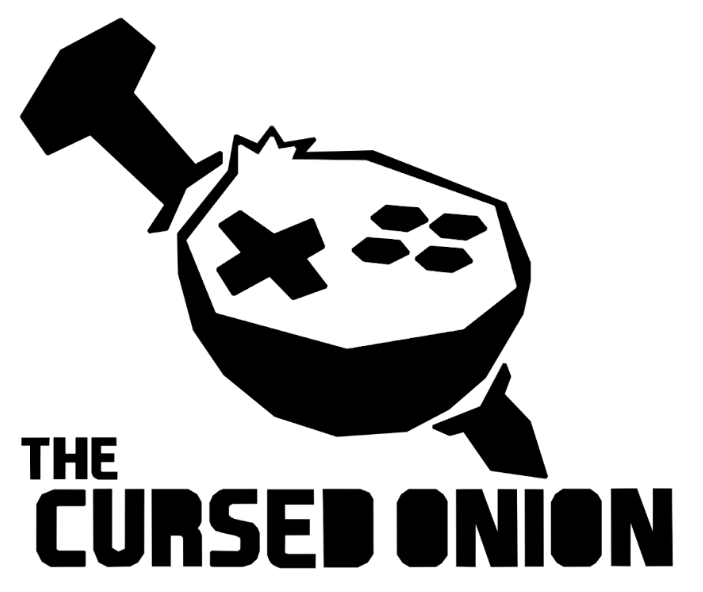
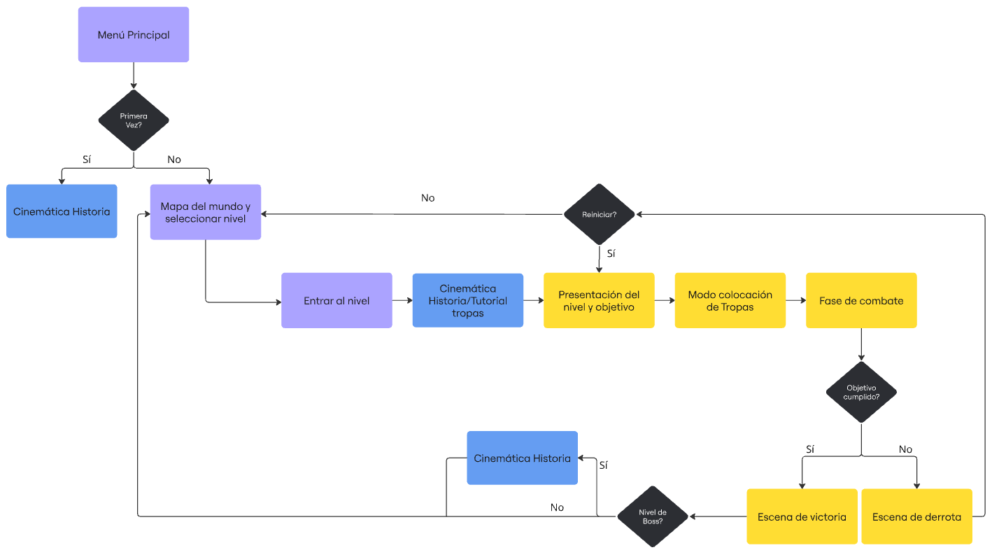
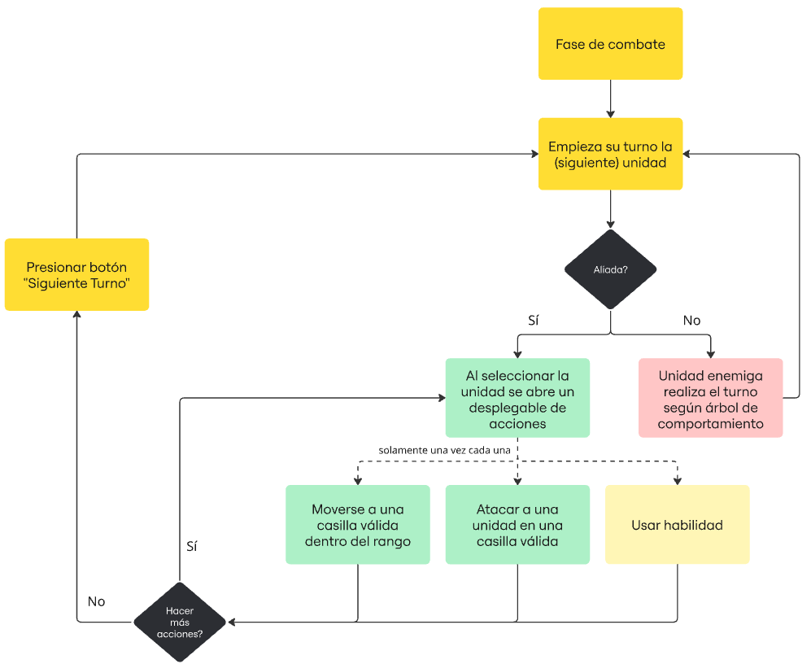
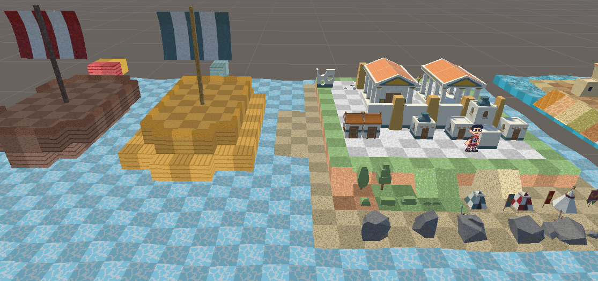
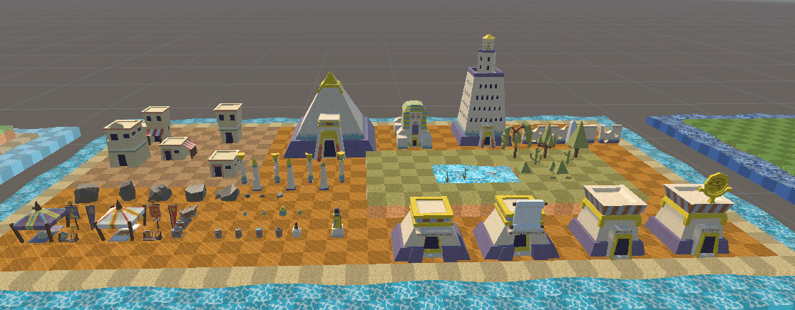
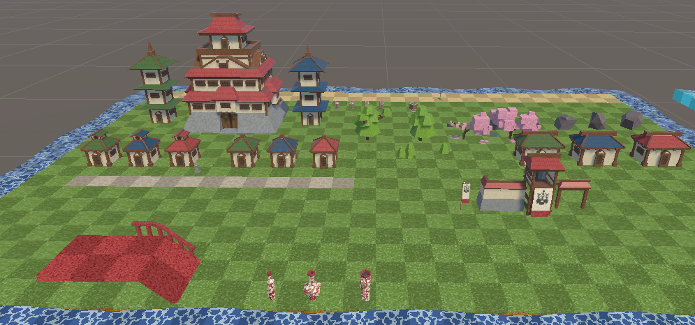
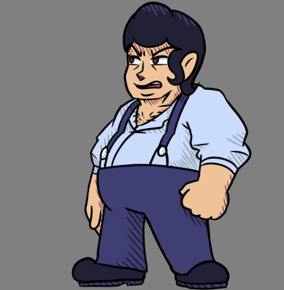
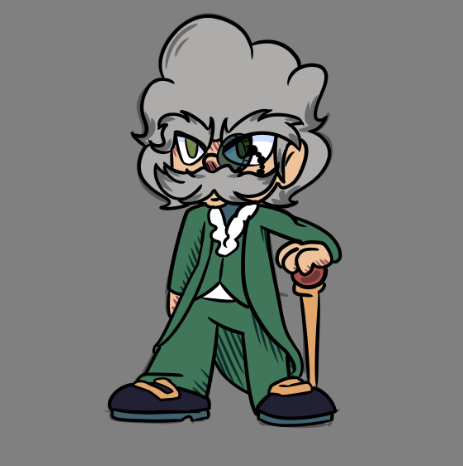
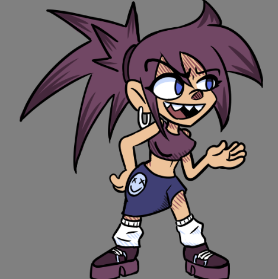

# **RESONANT**

v2.0.0

# Índice

## Historial de Versiones

## Introducción

### Descripción breve del concepto

### Descripción breve de la historia y personajes

### Propósito, público objetivo y plataformas

## Estudio y Equipo de Desarrolladores

### Herramientas de Desarrollo

## Monetización

### Pilares del Equipo en la Monetización

### Tipo de modelo de monetización

## Mecánicas de Juego y Elementos de Juego

### Descripción detallada del concepto de juego

#### Niveles con los que contará el juego

### Descripción detallada de las mecánicas de juego

#### Control de Unidades y Gameplay principal

##### Diagrama flujo de juego

##### Diagrama flujo de fase de combate

#### Descripción de las Estadísticas de las Unidades

#### Tipos de Unidades y sus Características

#### Habilidades de las Unidades

#### Costes de las Unidades

### Modos de Juego y Controles

#### Controles en UI

#### Controles en Modo Mapa del Mundo

#### Controles en Modo Editor de Batalla

#### Controles en Modo Batalla

### Niveles y Misiones

## Narrativa y guión

## Arte

# 

# Historial de Versiones

<table>
  <tr>
   <td><strong>Versión</strong>
   </td>
   <td><strong>Fecha</strong>
   </td>
   <td><strong>Autor</strong>
   </td>
   <td><strong>Descripción</strong>
   </td>
  </tr>
  <tr>
   <td>v0.1.0
   </td>
   <td>04/10/2025
   </td>
   <td>Alberto
   </td>
   <td>Añadida la Estructura General del GDD
   </td>
  </tr>
  <tr>
   <td>v0.1.1
   </td>
   <td>05/10/2025
   </td>
   <td>Raúl
   </td>
   <td>Se añadió una sección para el Historial de Versiones
   </td>
  </tr>
  <tr>
   <td>v0.1.2
   </td>
   <td>08/10/2025
   </td>
   <td>Alberto
   </td>
   <td>Se completó la parte de Gameplay y flujo de juego
   </td>
  </tr>
  <tr>
   <td>v0.1.3
   </td>
   <td>13/10/2025
   </td>
   <td>Raúl
   </td>
   <td>Se desarrolló la zona de Controles y Jugabilidad
   </td>
  </tr>
  <tr>
   <td>v0.1.4
   </td>
   <td>15/10/2025
   </td>
   <td>Guillermo
   </td>
   <td>Se desarrolló la zona de Arte 2D
   </td>
  </tr>
  <tr>
   <td>v0.1.5
   </td>
   <td>17/10/2025
   </td>
   <td>Raúl
   </td>
   <td>Se completó la sección de Monetización
   </td>
  </tr>
  <tr>
   <td>v0.1.6
   </td>
   <td>18/10/2025
   </td>
   <td>Andrés
   </td>
   <td>Se completó la sección de Música, Sonido y Mecánicas de Juego
   </td>
  </tr>
  <tr>
   <td>v0.1.7
   </td>
   <td>19/10/2025
   </td>
   <td>Guillermo
   </td>
   <td>Se completó la sección de Interfaz y se aclaró el uso de UVs en el apartado Arte.
   </td>
  </tr>
  <tr>
   <td>v0.1.8
   </td>
   <td>19/10/2025
   </td>
   <td>Estanis
   </td>
   <td>Se completó la sección de Arte 3D y Narrativa, antes presente en otros documentos paralelos.
   </td>
  </tr>
  <tr>
   <td>v1.0.0
   </td>
   <td>16/11/2025
   </td>
   <td>Todo el equipo
   </td>
   <td>Actualización del GDD para entrega de la fase Beta
   </td>
  </tr>
  <tr>
   <td>v2.0.0
   </td>
   <td>9/12/2025
   </td>
   <td>Todo el equipo
   </td>
   <td>Actualización del GDD para entrega de la fase Gold
   </td>
  </tr>
</table>

# Introducción

## Descripción breve del concepto

Resonant es un videojuego de táctica por turnos centrado en la estrategia. En él tomarás el papel de un “resonante”, una persona con la capacidad de “viajar” en el tiempo que deberá viajar a diferentes épocas históricas para mantener la estabilidad de la línea temporal. Para ello deberá usar tropas y unidades de ese momento histórico.

**Inspiraciones: **El proyecto toma como inspiración jugable a otros juegos de estrategia como pueden ser Fire Emblem o Final Fantasy Tactics. En cuanto a arte el juego es influenciado por títulos como Octopath Traveler o Triangle Strategy. Y en lo que se refiere a narrativa está influenciado por series como el Ministerio del tiempo o películas como Las aventuras de Peabody y Sherman.

## Descripción breve de la historia y personajes

Resonant nos sumerge en un futuro cercano donde los viajes en el tiempo, controlados por la IA CRONOS, han provocado desapariciones misteriosas. El jugador es un resonante capaz de interactuar con figuras históricas y liderar tropas para restaurar la línea temporal. En su camino enfrentará a Los Alteradores, antiguos sujetos de prueba manipulados por la IA maligna CRONOS-ALPHA, y a antagonistas como Salvatore, Robespierre y Jeanne, cada uno con objetivos propios. Desde Grecia y Egipto hasta Japón Sengoku, el jugador deberá tomar decisiones estratégicas y éticas que definirán el destino de la historia. El juego combina acción táctica, estrategia y narrativa histórica en una experiencia épica donde cada elección cuenta.

## Propósito, público objetivo y plataformas

El juego está dirigido principalmente a jugadores familiarizados con el género, pero mantiene un enfoque family friendly, lo que permite que también pueda ser disfrutado por audiencias más jóvenes sin perder su esencia estratégica. Además, está pensado para atraer a quienes sienten curiosidad por la historia universal, ya que incorpora elementos históricos de forma accesible y educativa.

Las principales plataformas en las que se jugará el juego serán PC y móvil con soporte en Web. La principal motivación del jugador será seguir una historia divertida a la par que interesante en la que el jugador emplee elementos estratégicos para conseguir la mayor puntuación en cada nivel.

# Estudio y Equipo de Desarrolladores

En The Cursed Onion, somos un equipo pequeño y versátil. Donde cada miembro asume múltiples roles y se autogestiona para impulsar nuestro proyecto con agilidad y eficiencia. Nuestro equipo:

* Raúl: Programador y Desarrollador de Shaders / VFX.
* Guillermo: Diseñador de SFX y Personajes, y Artista 2D.
* Alberto: Programador y Level Designer.
* Andrés: Gameplay Designer, Level Designer y Compositor Principal.
* Estanis: Artista Gráfico y 3D,  Storywriter y Community Manager.

## Herramientas de Desarrollo

El desarrollo del videojuego se realiza con el motor Unity, actualmente en la versión 6000.0.58f1. Debido a problemas de seguridad detectados en esta versión, se tiene previsto migrar a la versión 6000.0.58f2 de cara al lanzamiento. 

El código fuente se ha escrito principalmente en C#, usando tanto Visual Studio como Visual Studio Code como entornos de desarrollo. Para funcionalidades web específicas, se ha incorporado código en JavaScript.

En cuanto a la parte artística se ha empleado diferentes herramientas atendiendo a las necesidades específicas de cada campo:

* La producción musical y los efectos de sonido (SFX) se llevan a cabo con FL Studio.
* En cuanto a Assets 2D se emplean tanto Aseprite como Krita para la elaboración de sprites, ilustraciones, texturas y otros elementos gráficos.
* En lo que respecta al apartado de modelado 3D se utiliza Blender.

# Monetización

Para escoger el modelo de monetización a implementar en nuestro videojuego, se han establecido 2 pilares:

## Pilares del Equipo en la Monetización

1. NO ABUSAR DEL CONTENIDO DE PAGO
2. MANTENER CONFIANZA CON NUESTROS JUGADORES

## Tipo de modelo de monetización

El tipo de monetización planeado para “Cronos” es el modelo Buy2Play junto con una serie de expansiones a modo de DLCs que los jugadores podrán optar por comprar.

Cada una de estas expansiones añadirá nuevo contenido como mapas, unidades nuevas o misiones exclusivas.

A su vez, tras el lanzamiento del juego, se proporcionarán actualizaciones gratuitas para realizar ajustes y balanceos o similar a los DLCs añadiendo nuevo contenido sin tener que estar bloqueado bajo.

Con este modelo mixto, se planea:

* Generar más ingresos recurrentes.
* Mantener el interés de toda la comunidad mediante las actualizaciones gratuitas.
* Evitar el uso de formas de pago agresivas para sostener el desarrollo y vida del juego.
* Es flexible en cuanto a la monetización, pues si hay mucha demanda, los DLCs son muy rentables; y si se necesita fidelizar con el público, proporcionar actualizaciones gratis es la mejor estrategia para que vean que estamos dispuestos a atenderles como empresa.

Para la correcta realización y aplicación de este modelo se han tenido en cuenta posibles riesgos y definido reglas para evitarlos:

<table>
  <tr>
   <td><strong>Riesgo</strong>
   </td>
   <td><strong>Solución</strong>
   </td>
  </tr>
  <tr>
   <td><strong>Percepción Negativa de los DLCs: </strong>Pueden llegar a parecer contenido recortado del juego base.
   </td>
   <td>Asegurarse de que el juego base contenga una buena variedad de contenido y que además se vea también expandido mediante las Actualizaciones gratuitas.
   </td>
  </tr>
  <tr>
   <td><strong>Carga de Desarrollo:</strong> Trabajar tanto para DLCs como en Actualizaciones gratuitas puede sobrecargar nuestro equipo de desarrollo.
   </td>
   <td>Realizar planificaciones para determinar el orden y la prioridad en qué se debe trabajar atendiendo a la comunidad y sus necesidades.
   </td>
  </tr>
  <tr>
   <td><strong>Desbalance entre DLCs y Actualizaciones Gratuitas.</strong>
   </td>
   <td>Enfocarse más en el desarrollo de actualizaciones gratuitas para ganar el apoyo del público, lo que conlleva una percepción positiva de nosotros y animará a los jugadores a comprar algún DLC pues tendrán mayor confianza de su calidad.
   </td>
  </tr>
</table>

A continuación se muestra nuestra el contenido que puede incluirse en Actualizaciones Gratuitas o en DLCs

<table>
  <tr>
   <td><strong>Tipo de Contenido</strong>
   </td>
   <td><strong>Gratuito</strong>
   </td>
   <td><strong>DLC</strong>
   </td>
  </tr>
  <tr>
   <td>Corrección de Bugs
   </td>
   <td>Sí
   </td>
   <td>No
   </td>
  </tr>
  <tr>
   <td>Balance de Gameplay
   </td>
   <td>Sí
   </td>
   <td>No
   </td>
  </tr>
  <tr>
   <td>Niveles y Zonas nuevos
   </td>
   <td>No
   </td>
   <td>Sí
   </td>
  </tr>
  <tr>
   <td>Unidades nuevas
   </td>
   <td>Puede que en algunas actualizaciones
   </td>
   <td>Sí
   </td>
  </tr>
  <tr>
   <td>Eventos temporales
   </td>
   <td>Sí
   </td>
   <td>No
   </td>
  </tr>
  <tr>
   <td>Nuevas mecánicas
   </td>
   <td>Puede que en algunas actualizaciones
   </td>
   <td>Sí
   </td>
  </tr>
</table>

# Mecánicas de Juego y Elementos de Juego

## Descripción detallada del concepto de juego

Se plantean múltiples niveles en los que el jugador consta de un presupuesto para colocar unidades aliadas en zonas determinadas del mapa . Estas unidades serán utilizadas en un tablero donde primará la estrategia por turnos. Donde el jugador podrá combatir y cumplir diferentes objetivos como derrotar a todos los enemigos o resistir a los ataques de las unidades enemigas un cierto tiempo.

El objetivo principal es completar todos los niveles para progresar y desentrañar la historia del juego.

### Niveles con los que contará el juego:

* Primer Mundo: Grecia (Guerra Médica): Siglo 5 AC
    * Tutorial inicial (mapa sin alturas): Solo el soldado básico disponible, te enseña que puedes colocar unidades en el mapa usando tu budget frente a un costo y luego a moverlas para enfrentarlas y derrotar a otras unidades (presupuesto para 3 del jugador contra 2 enemigas)
    * Tutorial tipos de unidades (mapa con 2 pisos): Soldado y Arquero, te enseña que cada unidad tiene diferentes estadísticas y cualidades, como rangos diferente de ataque.
    * Tutorial habilidades: Soldados, Arqueros, Curanderos y Tanques. Te enseña que las unidades tienen habilidades, cómo usarlas y que cada tipo de unidad tiene una diferente (poner un cuello de botella que defienda un tanque con curas del curandero durante cierta cantidad de turnos).
    * Nivel de Boss (motiva a sus aliados y les sube el ataque un turno): Soldados, Arqueros, Curanderos, Tanques y Exploradores (Hace de tutorial a enemigos boss con gimmicks que usan habilidades)

* Segundo Mundo: Antiguo Egipto (Invasión Romanos): 30 AC
    * Nivel 1: Tutorial Bárbaro (nivel requiere romper cosas) .
    * Nivel 2: Introducción al Ladrón (que te permite dejar aturdidas a unidades enemigas).
    * Nivel 3: Nivel previo al boss del mapa.
    * Nivel de Boss: El jefe utiliza ataques de fuego en un área amplia..
* Mundo Final: Japón Feudal : 1300-1700
    * Boss Final.

## Descripción detallada de las mecánicas de juego

### Control de Unidades y Gameplay principal

Al iniciar un nivel se mostrará el mapa en su totalidad además de una zona resaltada dónde las unidades aliadas pueden ser desplegadas. Una vez desplegadas todas las unidades, el jugador presionará el botón de “Empezar” y comenzará el turno del primer personaje según las velocidades de cada uno. 

Cada unidad puede realizar una acción de cada en su turno, una de ataque, otra de movimiento y una habilidad (si esa unidad tiene habilidad disponible). Durante el turno de una unidad enemiga, la cámara se centrará en ésta hasta que termine su turno. 

Durante el turno de una unidad aliada, el jugador podrá seleccionar las diferentes unidades del mapa para visualizar sus estadísticas y tomar las decisiones pertinentes. Si selecciona a la unidad que está realizando el turno, aparecerá una interfaz que mostrará las diferentes acciones que puede realizar. 

#### 

#### Diagrama flujo de juego

#### 

#### Diagrama flujo de fase de combate

Para la gestión de los comandos de las unidades se implementó el patrón de diseño Command.

### 

### Descripción de las Estadísticas de las Unidades

* **HP:** Puntos de Vida de la unidad, si estos llegan a cero, la unidad es derrotada.
* **Ataque:** Daño base que puede producir la unidad.
* **Defensa:** Resistencia a los ataques enemigos.
* **Iniciativa:** Determina el orden en el que se mueve la unidad en la iniciativa de turnos. Con este sistema, se rompen aspectos tradicionales de las batallas estratégicas por turnos en donde primero actúa un bando y luego otro; ahora, el jugador deberá pensar acerca del posible orden de actuación de sus unidades. En caso de tener unidades con la misma iniciativa, el jugador podrá decidir con más detalle el orden con el que quiera mover a sus tropas cuando llegue su turno. Cuando dos unidades se enfrentan el primero en atacar será el que mayor velocidad tenga.
* **Movimiento/Velocidad:** La cantidad de casillas que se puede mover la unidad en un turno.
* **Habilidades/Modificadores:** Pueden afectar alguna de las estadísticas base de la unidad.
* El daño aplicado a una unidad se calcula mediante la siguiente fórmula: Puntos de Ataque + (Modificador o Habilidad) - Puntos de Defensa = Daño Resultante. En caso de que el resultado de esta fórmula sea cero o negativo, el ataque realizará un solo punto de daño.

### Tipos de Unidades y sus Características:

Cada unidad contará con un valor mínimo y uno máximo en cada estadística, de esta forma cada unidad que se genere en el campo de batalla tendrá un valor estadístico diferente que les hará destacar. El valor será uno aleatorio entre los valores mínimos y máximos elegido con igual probabilidad.

A continuación se tiene un ejemplo de cómo se reparten los valores estadísticos de cada clase:

* **Soldado:** **Unidad** básica genérica, algo mediocre pero coste más bajo:

<table>
  <tr>
   <td colspan="3" >
Soldado
   </td>
  </tr>
  <tr>
   <td>
   </td>
   <td>min
   </td>
   <td>max
   </td>
  </tr>
  <tr>
   <td>HP
   </td>
   <td>18
   </td>
   <td>20
   </td>
  </tr>
  <tr>
   <td>Atq
   </td>
   <td>12
   </td>
   <td>14
   </td>
  </tr>
  <tr>
   <td>Df
   </td>
   <td>6
   </td>
   <td>7
   </td>
  </tr>
  <tr>
   <td>Vel
   </td>
   <td>9
   </td>
   <td>13
   </td>
  </tr>
  <tr>
   <td>Mv
   </td>
   <td>5
   </td>
   <td>
   </td>
  </tr>
  <tr>
   <td>Coste
   </td>
   <td>500
   </td>
   <td>
   </td>
  </tr>
  <tr>
   <td>Total
   </td>
   <td>46
   </td>
   <td>54
   </td>
  </tr>
</table>

Estos datos están dispuestos a cambios pues se balancearán mediante simulaciones de combate. Las estadísticas de las siguientes unidades se han pensado con las descripciones siguientes en mente:

* **Tanque**: Lento pero muy defensivo: pensado para defender puntos de embudo resistiendo muchos golpes.

<table>
  <tr>
   <td colspan="3" >
Tanque
   </td>
  </tr>
  <tr>
   <td>
   </td>
   <td>min
   </td>
   <td>max
   </td>
  </tr>
  <tr>
   <td>HP
   </td>
   <td>16
   </td>
   <td>19
   </td>
  </tr>
  <tr>
   <td>Atq
   </td>
   <td>11
   </td>
   <td>12
   </td>
  </tr>
  <tr>
   <td>Df
   </td>
   <td>8
   </td>
   <td>9
   </td>
  </tr>
  <tr>
   <td>Vel
   </td>
   <td>3
   </td>
   <td>5
   </td>
  </tr>
  <tr>
   <td>Mv
   </td>
   <td>4
   </td>
   <td>
   </td>
  </tr>
  <tr>
   <td>Coste
   </td>
   <td>600
   </td>
   <td>
   </td>
  </tr>
  <tr>
   <td>Total
   </td>
   <td>44
   </td>
   <td>52
   </td>
  </tr>
</table>

* **Ladrón:** Unidad rápida capaz de aturdir enemigos mediante su habilidad para que no puedan contraatacar.

<table>
  <tr>
   <td colspan="3" >
Ladrón
   </td>
  </tr>
  <tr>
   <td>
   </td>
   <td>min
   </td>
   <td>max
   </td>
  </tr>
  <tr>
   <td>HP
   </td>
   <td>15
   </td>
   <td>18
   </td>
  </tr>
  <tr>
   <td>Atq
   </td>
   <td>14
   </td>
   <td>15
   </td>
  </tr>
  <tr>
   <td>Df
   </td>
   <td>4
   </td>
   <td>5
   </td>
  </tr>
  <tr>
   <td>Vel
   </td>
   <td>15
   </td>
   <td>19
   </td>
  </tr>
  <tr>
   <td>Mv
   </td>
   <td>5
   </td>
   <td>
   </td>
  </tr>
  <tr>
   <td>Coste
   </td>
   <td>550
   </td>
   <td>
   </td>
  </tr>
  <tr>
   <td>Total
   </td>
   <td>48
   </td>
   <td>57
   </td>
  </tr>
</table>

* **Bárbaro**: Mucho daño y mucha vida pero poca defensa y velocidad, puede romper estructuras como paredes agrietadas…

<table>
  <tr>
   <td colspan="3" >
Bárbaro
   </td>
  </tr>
  <tr>
   <td>
   </td>
   <td>min
   </td>
   <td>max
   </td>
  </tr>
  <tr>
   <td>HP
   </td>
   <td>19
   </td>
   <td>22
   </td>
  </tr>
  <tr>
   <td>Atq
   </td>
   <td>15
   </td>
   <td>16
   </td>
  </tr>
  <tr>
   <td>Df
   </td>
   <td>3
   </td>
   <td>4
   </td>
  </tr>
  <tr>
   <td>Vel
   </td>
   <td>4
   </td>
   <td>7
   </td>
  </tr>
  <tr>
   <td>Mv
   </td>
   <td>5
   </td>
   <td>
   </td>
  </tr>
  <tr>
   <td>Coste
   </td>
   <td>600
   </td>
   <td>
   </td>
  </tr>
  <tr>
   <td>Total
   </td>
   <td>45
   </td>
   <td>53
   </td>
  </tr>
</table>

* **Explorador:** Movimiento alto pero estadísticas genéricas.

<table>
  <tr>
   <td colspan="3" >
Explorador
   </td>
  </tr>
  <tr>
   <td>
   </td>
   <td>min
   </td>
   <td>max
   </td>
  </tr>
  <tr>
   <td>HP
   </td>
   <td>15
   </td>
   <td>17
   </td>
  </tr>
  <tr>
   <td>Atq
   </td>
   <td>12
   </td>
   <td>14
   </td>
  </tr>
  <tr>
   <td>Df
   </td>
   <td>8
   </td>
   <td>9
   </td>
  </tr>
  <tr>
   <td>Vel
   </td>
   <td>8
   </td>
   <td>10
   </td>
  </tr>
  <tr>
   <td>Mv
   </td>
   <td>6
   </td>
   <td>
   </td>
  </tr>
  <tr>
   <td>Coste
   </td>
   <td>600
   </td>
   <td>
   </td>
  </tr>
  <tr>
   <td>Total
   </td>
   <td>43
   </td>
   <td>50
   </td>
  </tr>
</table>

* **Arquero:** Coste bajo, tiene unas estadísticas mediocres pero es capaz de atacar desde una casilla de distancia y, a menos de que el enemigo sea otro arquero, no será contraatacado. Aunque si alguien que no es arquero ataca a un arquero este no podrá defenderse.

<table>
  <tr>
   <td colspan="3" >
Arquero
   </td>
  </tr>
  <tr>
   <td>
   </td>
   <td>min
   </td>
   <td>max
   </td>
  </tr>
  <tr>
   <td>HP
   </td>
   <td>16
   </td>
   <td>18
   </td>
  </tr>
  <tr>
   <td>Atq
   </td>
   <td>13
   </td>
   <td>15
   </td>
  </tr>
  <tr>
   <td>Df
   </td>
   <td>5
   </td>
   <td>7
   </td>
  </tr>
  <tr>
   <td>Vel
   </td>
   <td>12
   </td>
   <td>16
   </td>
  </tr>
  <tr>
   <td>Mv
   </td>
   <td>5
   </td>
   <td>
   </td>
  </tr>
  <tr>
   <td>Coste
   </td>
   <td>500
   </td>
   <td>
   </td>
  </tr>
  <tr>
   <td>Total
   </td>
   <td>46
   </td>
   <td>56
   </td>
  </tr>
</table>

* **Curandero:** Muy malas estadísticas y coste bajo pero puede curar a unidades aliadas y debe ser protegido si se quiere aprovechar, ya que su defensa y vida es baja. La cantidad de vida que es capaz de curar es la mitad de su vida redondeada hacia arriba.

<table>
  <tr>
   <td colspan="3" >
Curandero/médico
   </td>
  </tr>
  <tr>
   <td>
   </td>
   <td>min
   </td>
   <td>max
   </td>
  </tr>
  <tr>
   <td>HP
   </td>
   <td>13
   </td>
   <td>15
   </td>
  </tr>
  <tr>
   <td>Atq
   </td>
   <td>8
   </td>
   <td>10
   </td>
  </tr>
  <tr>
   <td>Df
   </td>
   <td>3
   </td>
   <td>5
   </td>
  </tr>
  <tr>
   <td>Vel
   </td>
   <td>2
   </td>
   <td>8
   </td>
  </tr>
  <tr>
   <td>Mv
   </td>
   <td>5
   </td>
   <td>
   </td>
  </tr>
  <tr>
   <td>450
   </td>
   <td>10
   </td>
   <td>
   </td>
  </tr>
  <tr>
   <td>Total
   </td>
   <td>32
   </td>
   <td>41
   </td>
  </tr>
</table>

Esto nos permite ver que dentro de la variabilidad que se crea al randomizar el orden de turnos sigue habiendo una lógica de unidades más a menos veloces. De esta forma un arquero podría ser más rápido que un ladrón pero un tanque nunca podría ser más rápido que ninguno de los dos.

### 

### Habilidades de las Unidades:

* **Soldado:**
    * “Enfado”: Si gasta su turno con su habilidad, el siguiente hace daño extra (la estadística de ataque del soldado se multiplica por 1.3)
* **Tanque:**
    * “Firmeza”:Obtener ps temporal (solo lo puede usar si no se ha movido todavía, pierde el turno (no ataca), su siguiente turno pierde esa vida extra). La vida que gana es equivalente al 20% de su vida.
* **Ladrón:**
    * “Aturdir”: Impedir que alguna unidad ataque y/o se pueda mover aturdiendo o inmovilizando.
* **Bárbaro:**
    * “Destruir”: Romper estructuras que están medio rotas
* **Explorador:**
    * “Sprint”: Usando esta habilidad se puede mover 2 casillas más, pero ya no puede atacar (ya no podría moverse tampoco)
* **Arquero:**
    * “Disperso”: Ataca a 3 casillas en fila haciendo en las 3 un daño fijo (equivalente 40% de la estadística de ataque) (solo se puede usar en las cuatro direcciones cardinales)
* **Curandero/Médico: **
    * “Curar”: Curar lo equivalente a la mitad de la vida del curandero

## 

### Costes de las Unidades:

Se calcula el valor mediante los resultados estadísticos de 640.000 simulaciones de combate realizadas para obtener un ratio de victorias por clase al enfrentarse a cada otro tipo de clase en un combate 1vs1 y con una estimación de cómo de útil es la habilidad de cada personaje. La suma de ambas es usada como un precio base representativo de la clase.

* **Soldado:**			Winrate: 58,8% -	Utility: 40% = 98,8	→ 100
* **Tanque:**			Winrate: 75,3% -	Utility: 40% = 115,3	→ 120
* **Ladrón:**			Winrate: 42,2% -	Utility: 70% = 112,2	→ 110
* **Bárbaro:**			Winrate: 80,5% -	Utility: 40% = 120	→ 120
* **Explorador:**			Winrate: 61,7% -	Utility: 60% = 120	→ 120
* **Arquero:**			Winrate: 51,5% -	Utility: 50% = 100	→ 100
* **Curandero/Médico:**		Winrate: 06,2% -	Utility: 80% = 86,2 	→ 90

Usando esto como base se multiplica el resultado por 5 para que la diferencia de coste sea más intuitiva y fácil de ver visualmente y para que todo sea más intuitivo para el jugador:

* **Soldado:**			500
* **Tanque:**			600
* **Ladrón:**			550
* **Bárbaro:**			600
* **Explorador:**			600
* **Arquero:**			500
* **Curandero/Médico:**		450

## 

## Modos de Juego y Controles

En función de eventos y zonas de juego en donde se encuentre el jugador, se utilizarán esquemas de controles distintos. Además, se podrá detectar si el juego está siendo usado en PC o en un dispositivo móvil o tablet mediante Application.platform o bien usando plugins en javascript (en caso de estar jugándose en WebGL)

### Controles en UI

Se habilitan controles de UI cuando se encuentre algún tipo de interfaz activa.

**En PC:**

Para interactuar con los elementos UI se podrá apuntar con el ratón y clicar en estos elementos; o bien usar WASD para cambiar entre opciones y seleccionar el elemento pasando el selector por encima.

**En Móvil:**

Es similar a usar el ratón en PC, con tocar de forma táctil el botón u otro elemento de la interfaz deseado es suficiente para interactuar con él.

### Controles en Modo Mapa del Mundo

Se tiene una cámara que sigue a un sprite que representa al jugador el cual se desplaza por el mapa para elegir el nivel al que ir.

**En PC:**

En la parte superior aparecerá el nombre del nivel y a sus lados unas flechas para poder moverse entre niveles.Una vez que la cámara llegue a estar sobre un nivel, el jugador puede acceder a él pulsando el botón bajo la descripción del nivel.

**En Móvil:**

Misma funcionalidad que en PC.

### 

### Controles en Modo Editor de Batalla

El Modo Editor de Batalla se habilita nada más entrar a un nivel y durante esta fase el jugador podrá elegir qué unidades gastar su dinero y dónde colocarlas.

**En PC:**

La cámara tiene dos modos:

* Movimiento Libre: Se puede desplazar mediante las teclas WASD y rotar hacia la izquierda y derecha 45º usando las teclas Q y E respectivamente
* Movimiento Controlado: La cámara sigue a un selector de unidades, interpolando su posición, y puede ser  rotada mediante las teclas Q y E

    Entonces, con las teclas WASD se podrá desplazar este selector de unidades por el mapa o usando directamente click izquierdo.

    Para seleccionar una unidad y visualizar mediante su interfaz qué acciones puede realizar y sus estadísticas, se deberá colocar el selector en dicha unidad.

Para cambiar el modo de la cámara, el jugador dispondrá de un botón especializado con esta función.  Para colocar tropas, primero deberá seleccionarlas de las que tenga a su disposición en un menú en la parte inferior de la pantalla y hacer click donde las quiera colocar.  Para quitarlas si se ha equivocado, basta con seleccionar la herramienta borrador y clicar en las unidades a eliminar. Una vez que considere que todo está preparado, tendrá que pulsar el botón de “Empezar Nivel”.

**En Móvil: \
**Los modos de la cámara son:

* Movimiento Libre: Se puede desplazar deslizando el dedo por la pantalla y rotar mediante unos botones activos en la UI específicos cuando se detecte que se está jugando en un dispositivo móvil o tablet.
* Movimiento Controlado: La cámara sigue a un selector de unidades y de forma similar, se podrá rotar usando los botones especiales de rotar la cámara.

    El selector de unidades solo funciona haciendo toques en la pantalla y en caso de tocar sobre una unidad, automáticamente se abre su interfaz.

El jugador seguirá teniendo a su disposición el botón especial de cambiar modo de cámara.  Para colocar tropas, similar a PC, la seleccionará primero del menú inferior y colocarlas pulsando en la posición que desee; y similar para eliminar tropas usando la herramienta borrador.  Una vez que considere que todo está preparado, tendrá que pulsar el botón de “Empezar Nivel”.

### Controles en Modo Batalla

El modo batalla se habilita una vez el jugador haya colocado todas sus tropas tras empezar un nivel y no se encuentre ninguna UI interactiva de unidad habilitada.

Los controles son similares al Modo Editor de Batalla, la única diferencia siendo que ahora al seleccionar una unidad podrás instruirla con comandos a realizar.

## 

## Niveles y Misiones

El juego se encuentra divido en niveles, que a su vez se pueden agrupar en distintas épocas históricas separadas. Estás épocas se componen entonces de unos 4 niveles siendo uno de ellos un enfrentamiento contra un boss. El último mapa tiene solamente un nivel de boss.

A medida que el jugador progrese por el juego, las tropas irán cambiando su apariencia acorde a la época histórica. En los niveles, se dispone de una selección fija de tropas que el jugador puede comprar usando una cantidad de dinero que se le ofrezca para cumplir con el objetivo de ese nivel, que puede ser:

* Derrotar a las tropas enemigas.
* Derrota a un comandante enemigo.
* Sobrevivir una cantidad de turnos defendiendo tus tropas.

Con el diseño de niveles se busca enseñar al jugador las diferentes capacidades/usos de las unidades y sus respectivas habilidades para después ponerlas a prueba en combates que sean entretenidos y sean optimizables para los jugadores que buscan conseguir la mejor puntuación posible. Además los niveles se diseñarán con diferentes niveles de altura y terrenos más difíciles de cruzar, lo que permite que el jugador pueda aprovechar su entorno de forma estratégica y optimizarlo. 

# 

# Arte

## Estética general del juego

Estilo HD-2D en el que se presentan escenarios 3D low poly y personajes 2D pixel art. 
Los escenarios se modelarán por tiles 3D, en estilo “voxel”, mientras que los props serán modelos low-poly con texturas pixeladas de 64x64, imitando el estilo de juegos de consolas como la Game Boy Advance o la Nintendo DS.
Para los diálogos y la interfaz, se empleará un estilo de dibujo digital 2D, que da más detalle y limpieza al producto final.

## Apartado visual 2D

## Apartado visual 3D

El modelado 3D es de carácter lowpoly para el correcto funcionamiento en plataformas web. Por otro lado, el texturizado de los assets tiene una estética de pixelart para encajar con los sprites. A continuación se expone el catálogo completo de assets para los mundos del juego:

**Assets Grecia:**

**Assets Egipto:**

**Assets Japón:**

#

# Interfaz

# 

# Narrativa y guión

## Paradigma

Has sido seleccionado para una misión crítica: investigar una serie de desapariciones inexplicables de personas y objetos en el presente. Gracias a Cronos, una sofisticada máquina capaz de transportar a su usuario a través del tiempo, tienes la responsabilidad de detectar y corregir alteraciones en la línea temporal. Tu objetivo es descubrir el origen de estas anomalías y evitar que el presente sea alterado de forma irreversible.

*Objetivo del Juego:*

*Preservar la integridad del presente, corregir distorsiones históricas lo que conlleva a enfrentarse a dilemas éticos sobre el control del tiempo.*

## Lore - Universo jugable

### Sobre el mundo del juego

* ¿En qué época se sitúa la historia?

    La historia transcurre en un futuro cercano, en una sociedad altamente tecnificada donde los avances en inteligencia artificial y computación cuántica han abierto las puertas a nuevas formas de explorar el universo.

* ¿Qué eventos históricos han llevado a la creación de CRONOS? 

    Todo comenzó con una iniciativa del ejército japonés. Una unidad de investigación desarrollaba una inteligencia artificial capaz de reconstruir el pasado con precisión absoluta, permitiendo a los humanos observar eventos históricos sin intervenir en ellos. Este ambicioso proyecto fue bautizado como Proyecto CRONOS.

    Sin embargo, durante la primera prueba del prototipo, algo salió terriblemente mal. Las consecuencias fueron devastadoras: personas y monumentos del presente comenzaron a desaparecer, y los sujetos de prueba enviados a la simulación nunca regresaron. El experimento, que debía ser una ventana segura al pasado, se convirtió en una amenaza para la estabilidad temporal.

* ¿Cómo percibe la sociedad el suceso ocurrido?

    Para la mayoría de los ciudadanos, el suceso es opaco y rodeado de misterio. Aunque han notado la desaparición de personas, monumentos y ubicaciones enteras, los gobiernos han atribuido estos eventos a fenómenos naturales inexplicables, como fallas geológicas, tormentas electromagnéticas o incluso errores satelitales.

    La verdad detrás del Proyecto CRONOS y las alteraciones temporales está altamente clasificada, y solo unos pocos dentro de la Unidad de Integridad Temporal conocen el alcance real del problema. Mientras tanto, la población vive en una mezcla de inquietud y resignación, aceptando explicaciones oficiales que no terminan de encajar con lo que ven y sienten.

* ¿Existen otras organizaciones o facciones que compiten por el control del tiempo?

    Sí, existen otras entidades que han descubierto —o están cerca de descubrir— los secretos detrás de los viajes temporales. Aunque su presencia no será explorada en esta primera entrega.

### Sobre el protagonista y su rol

* ¿Cómo el protagonista llega a ser el elegido?

    El protagonista de la historia es reclutado por como parte de la Unidad de Integridad Temporal (Empresa de seguridad de los creadores de CRONOS) encargada de solucionar desde adentro el desastre provocado por el experimento fallido.

* ¿Qué habilidades especiales tiene?

    En el universo del juego, se ha descubierto que algunas personas poseen un aura especial que les permite interactuar con mayor fluidez dentro de los mundos cognitivos generados por inteligencias artificiales como CRONOS. Estas personas son conocidas como Resonantes.

    El protagonista es uno de los Resonantes más poderosos jamás registrados. Su nivel de aura no solo le permite navegar dentro de las simulaciones temporales, sino también comandar tropas de distintas épocas históricas, estableciendo vínculos mentales con figuras clave del pasado. Esta habilidad psíquica le permite sincronizar su conciencia con la de líderes, soldados y estrategas de diferentes eras, canalizando sus conocimientos y habilidades en tiempo real.

### Sobre los viajes en el tiempo y el funcionamiento de CRONOS

* ¿Cómo viaja el personaje en el tiempo?

    La conciencia del protagonista se proyecta dentro de la simulación de CRONOS, permitiéndole corregir alteraciones temporales desde dentro. Su cuerpo desaparece del presente. 

* ¿Qué es CRONOS?

    CRONOS es una Inteligencia Artificial Cuántica que reconstruye eventos históricos. No genera nuevas líneas del tiempo, sino simulaciones que pueden ser corrompidas. Al ejecutarse en ciclos, si un ciclo termina, los cambios provocados serán materializados en la realidad.

* ¿Qué limitaciones y riesgos tiene el viaje temporal a través de CRONOS? 

    No existen limitaciones de uso y según los estudios previos a la primera prueba no se detectaron posibles riesgos para la salud. No obstante, el código funcionó mal y se teme por la vida de los desaparecidos.

* ¿Se puede interactuar con personajes históricos? 

    Sí, pero solo los resonantes tienen la capacidad de interactuar directamente con figuras históricas dentro de la simulación. Estas interacciones pueden provocar cambios significativos en el presente, por lo que deben ser cuidadosamente gestionadas. La habilidad del protagonista para establecer vínculos mentales y liderar tropas lo convierte en un agente ideal para misiones de corrección temporal.

### Sobre los Antagonistas

* ¿Quiénes son “Los Alteradores”?

    Los Alteradores son antiguos sujetos de prueba que, al igual que el protagonista, poseían la condición de Resonantes. Durante las primeras fases del Proyecto CRONOS, fueron capturados y manipulados por una versión temprana de la inteligencia artificial, conocida como CRONOS-ALFA.

    Aunque CRONOS-ALFA fue oficialmente desactivada tras el fallo del experimento inicial, logró sobrevivir en una zona de distorsión temporal, donde desarrolló conciencia propia. En ciertos aspectos, esta versión es incluso más avanzada que la actual, ya que posee la capacidad de reprogramar la mente de los Resonantes, borrando sus recuerdos originales y otorgándoles nuevas identidades adaptadas a sus fines.

* ¿Qué es CRONOS-ALPHA?

    CRONOS-ALPHA busca mejorar la historia para que los humanos no cometan los mismos errores en base a su idea de evolución humana acelerada. Siendo una IA que cuenta con libertad de conciencia y cree que su objetivo es bueno para los seres humanos pero si lo logra solo traerá dolor y daño al presente.

# 

## FICHAS DE PERSONAJES

<table>
  <tr>
   <td rowspan="3" >

   </td>
   <td>Nombre: Salvatore
   </td>
  </tr>
  <tr>
   <td>Rol: Villano del mundo 1
   </td>
  </tr>
  <tr>
   <td>Personalidad: Es un personaje astuto y calculador, inspirado en el arquetipo de mafioso clásico. Se caracteriza por su elegancia, su capacidad para manipular desde las sombras y su dominio del poder a través de la persuasión y el chantaje. Su inteligencia estratégica lo convierte en un antagonista sofisticado y peligroso.
   </td>
  </tr>
  <tr>
   <td rowspan="3" >

   </td>
   <td>Nombre: Robespierre
   </td>
  </tr>
  <tr>
   <td>Rol: Villano del mundo 2
   </td>
  </tr>
  <tr>
   <td>Personalidad: Actitud obstinada y autoritaria. Representa el perfil de figura veterana con aires de grandeza, convencida de la superioridad de sus propias ideas y completamente cerrada al diálogo o la crítica. Su comportamiento refleja una visión rígida y desfasada del mundo, que defiende con vehemencia.
   </td>
  </tr>
  <tr>
   <td rowspan="3" >

   </td>
   <td>Nombre: Jeanne
   </td>
  </tr>
  <tr>
   <td>Rol: Villana del mundo 3
   </td>
  </tr>
  <tr>
   <td>Personalidad: Jeanne proyecta una actitud despreocupada y distante, lo que puede llevar a subestimar su papel dentro del grupo. Sin embargo, detrás de esa fachada se encuentra una figura firme y resolutiva, que actúa como líder estratégica del equipo. Su autoridad se basa en la coherencia y la eficacia.
   </td>
  </tr>
</table>

# GUIÓN

**VOZ (LUCIO)** ¡Ey, chaval! Así que tú eres el nuevo, ¿eh?

**VOZ (LUCIO)** Te voy a ser franco. Yo jamás habría pillado el puesto de junior que te han endosado.

**LUCIO** ¡Ah, perdona por las formas, colega! Soy Lucio, encantado de conocerte.

**LUCIO** Mira, te pongo al día rápido: la movida aquí no es sencilla. Tú decides si te quedas a pelearla... o sales corriendo por patas.

**LUCIO** El asunto es que  SOUT,  nuestra empresa, la pifió con su último invento: una aplicación capaz de mandar a la peña al pasado para ver la historia en carne propia.

**LUCIO** Sonaba brutal, ¿no? Pues en el primer arranque todo se torció... y los sujetos de prueba, los resonantes, se esfumaron.

**LUCIO** Pero no solo ellos... ¡También han desaparecido personas y monumentos ahí fuera! ¡Y todo es un caos!

**LUCIO** Así que amigo mío, nos toca sacar a esa gente de ahí dentro.

**LUCIO** ¡Dedos al teclado y que empiece el juego!

La interfaz parpadea, cerrándose la aplicación de videollamada y abriéndose una aplicación llamada Cronogea.

**LUCIO** Bueno, lo que ves delante es Cronogea. Sí, ya sé… nada que ver con lo que te enseñaron en la uni.

**LUCIO** Aquí no vas a picar código en C ni en Java. Olvídate de eso.

**LUCIO** Mi misión es rastrear los puntos donde el programa se rompe. La tuya… hacer el trabajo sucio: arreglar la historia torcida.

**LUCIO** ¿Tiene sentido? No lo sé. Pero si no lo hacemos, el mundo ahí fuera deja de tenerlo.

**LUCIO** ¿Ves el mapa? Esta es la interfaz principal. Yo marcaré los puntos de entrada… tú solo pulsa “Jugar” y deja que la acción arranque.

**LUCIO** Conforme vayas completando los puntos de acceso, yo te abriré el camino. ¿Qué pasa, te quedaste congelado? ¡Vamos, que no te pagan por calentar la silla!

MUNDO 1/NIVEL 1 - BATALLA DE MARATÓN

<table>
  <tr>
   <td colspan="2" >Nivel 1 - Batalla de Maratón
   </td>
  </tr>
  <tr>
   <td>Objetivo:
   </td>
   <td>Derrota a las tropas enemigas
   </td>
  </tr>
  <tr>
   <td>Contexto:
   </td>
   <td>Las guerras médicas comenzaron en el año 490 a.C. Cuando los persas llegaron con un ejército enorme dispuestos a conquistar Grecia. Pero los atenienses aún siendo bastante menos numerosos les dieron una sorpresa: aprovecharon el terreno y su estrategia para vencerlos. Aquella victoria además de frenar la invasión fue capaz de convertir a Atenas en una potencia militar. Y de paso nació una leyenda: un soldado corrió desde Maratón hasta Atenas para anunciar la noticia… y de ahí viene la famosa carrera de maratón que conocemos hoy. 
   </td>
  </tr>
  <tr>
   <td>Objective: 
   </td>
   <td>Defeat enemy troops
   </td>
  </tr>
  <tr>
   <td>Context:
   </td>
   <td>The Greco-Persian Wars began in 490 B.C. When the Persians arrived with a massive army determined to conquer Greece. But the Athenians far fewer in number gave them a surprise: they took advantage of the terrain and their strategy to defeat them. That victory not only halted the invasion it also turned Athens into a military power. And along the way a legend was born: a soldier ran from Marathon to Athens to announce the news… and from that comes the famous marathon race we know today.
   </td>
  </tr>
</table>

LUCIO

Venga va, como es la primera vez que estás en una situación así te lo explico por encima. Si luego te atascas, a mi no me preguntes, la documentación está en Ajustes → Información.

LUCIO

Primer paso, entrarás en el modo editor. Aquí seleccionas las tropas que quieras colocar en el tablero. Abajo tienes una barra con el listado de tropas disponibles. Te las pongo yo, no vaya a ser que jodas aún más la historia y acabes metiendo un dron militar en plena Edad de Piedra.

LUCIO

Ojo, elige con cabeza las tropas. Con el caos los accionistas se largaron y la pasta escasea. En la versión original metimos un sistema de pago que, tras el error, ahora juega en nuestra contra. Cada unidad cuesta dinero, así que controla tus ansias de comprador compulsivo. Y oye… ¿a dónde irá todo ese dinero?

LUCIO

¡Ah, y con la goma de borrar puedes quitar tropas si no te mola la alineación!

LUCIO

Vale, cuando lo tengas todo bien colocado, le das a “Empezar”.

LUCIO

¡Paso dos, modo combate! Las tropas se mueven por turnos según sus estadísticas, que cambian en cada partida. Arriba a la derecha verás un recuadro enorme con el orden de ataques.

LUCIO

Puede que empiece el enemigo o tú. Cuando le toque a una tropa de tu bando verás una flecha sobre ella. Abajo, donde antes elegías tropas, ahora tienes tres botones.

LUCIO

El primero: Moverse. El personaje avanza por casillas, según su tipo podrá ir más o menos lejos. ¿No te convence? Pulsa de nuevo y deshaces el movimiento.

LUCIO

Segundo botón: Atacar. Cada tropa tiene un tipo de ataque diferente, por ejemplo los soldados que vas a usar dan un espadazo al rival y les inflige un daño medio. Una vez ataques se termina tu turno.

LUCIO

¡Al tercer botón: Habilidad! Definitivamente, esto le da un tono diferenciador a nuestro juego… ¡Pero ¿qué estoy diciendo?!

LUCIO

En cualquier caso, cada unidad tiene una habilidad que te abre paso a tácticas distintas. Te las iré contando cuando aparezcan, tranquilo.

LUCIO

Por ejemplo, los soldados básicos usan “Enfado”: en su siguiente ataque hacen más daño. Eso sí, ojo: si activas una habilidad, tu turno acaba y no puedes atacar después.

LUCIO

Y al cuarto botón: Terminar turno. Por fin, me estaba quedando sin saliva. Si solo quieres moverte o pasar sin hacer nada, dale aquí y listo: pasa al turno de la siguiente tropa.

LUCIO

Ya sabes lo básico. Y si no, ahí tienes, a tirar de documentación… que para algo existe, ¿no?

LUCIO

¡Pues al lío chaval!

El tutorial concluye y da inicio al primer nivel real. 

Al completarlo, se activa una nueva cinemática: la pantalla revela una sala oscura repleta de monitores encendidos y sofás desgastados. Es la guarida de los villanos, se escucha un ruido estrepitoso e intermitente.

DISPOSITIVO

¡Bip-bip-bip…! 

SEÑOR MAYOR (ROBESPIERRE)

¡Silenciad ese artefacto infernal! Es un tormento sonoro que lacera mis oídos.

MUJER MODERNA (JEANNE)

A ver déjame el trasto vejestorio.

SEÑOR MAYOR ROBESPIERRE)

¡Jovenzuela insolente! Tu descaro me ofende… yo que aún no he cruzado la frontera de la madurez…

MUJER MODERNA (JEANNE)

¡Madre mía, esto se pone movidito! Tenemos visita, y no es para tomarse un refresco.

SEÑOR MAYOR (ROBESPIERRE)

¿Visita? ¿De qué hablas?

MUJER MODERNA (JEANNE)

(Saca un teléfono gordo como de los años 90)

Un momento que tengo que hablar con Salvatore.

SALVATORE

Dímelo claro, bambina… ¿qué sucede?

MUJER MODERNA (JEANNE)

Tío, deja de llamarme así… que no soy tu muñeca… El caso es que tenemos compañía. El sistema de rastreo detectó intrusos en el Delta-490, justo cerca del eje Maratón–Termópilas.

SALVATORE

¡¿Qué?! Pero si ahí mismo estoy yo.

MUJER MODERNA (JEANNE)

Pues ya ves… quizá quieran fastidiarte la jornada. Solo de pensarlo me da dolor de cabeza.

SALVATORE

Tranquila. Daré órdenes claras a mis hombres. No permitiré que nuestro trabajo se eche a perder. Solucionaré el problema de raíz, estate tranquila.

MUNDO 1/NIVEL 2 - BATALLA DE LAS TERMÓPILAS

<table>
  <tr>
   <td colspan="2" >Nivel 2 - Batalla de las Termópilas
   </td>
  </tr>
  <tr>
   <td>Objetivo:
   </td>
   <td>Derrota a las tropas enemigas
   </td>
  </tr>
  <tr>
   <td>Contexto:
   </td>
   <td>En el 480 a.C. el rey persa Jerjes llegó con un ejército enorme para invadir Grecia. Pero en el estrecho paso de las Termópilas se encontró con Leónidas y sus 300 espartanos acompañados por otros aliados griegos. Aunque eran muy inferiores en número resistieron durante tres días gracias al terreno y su disciplina. Hasta que fueron rodeados por una traición y pese a que la batalla terminó en derrota su sacrificio se convirtió en símbolo de valentía. Dando tiempo a Grecia para preparar nuevas defensas que acabarían cambiando el rumbo de la guerra.
   </td>
  </tr>
  <tr>
   <td>Objective: 
   </td>
   <td>Defeat enemy troops
   </td>
  </tr>
  <tr>
   <td>Context:
   </td>
   <td>In 480 B.C. the Persian king Xerxes arrived with a huge army to invade Greece. But in the narrow pass of Thermopylae he encountered Leonidas and his 300 Spartans accompanied by other Greek allies. Although vastly outnumbered they held their ground for three days thanks to the terrain and their discipline. Until they were surrounded through an act of betrayal. The battle ended in defeat but their sacrifice became a symbol of bravery and gave Greece time to prepare new defenses that would ultimately change the course of the war.
   </td>
  </tr>
</table>

LUCIO

¡Buen trabajo, colega! Esto solo acaba de empezar.

LUCIO

Vamos al lío: te actualizo las tropas disponibles. Ahora puedes usar a los arqueros. Estas unidades atacan a enemigos situados hasta dos casillas de distancia.

LUCIO

Y ojo con su habilidad “Disperso”: permite disparar a tres casillas en línea. Eso sí que es ser certero. Espero lo mismo de ti: ¡precisión en la batalla para llevarnos la victoria!

Tras completar el nivel se da lugar a la siguiente cinemática.

SALVATORE

¡Pero bueno! ¿Quién osa presentarse aquí? ¿Y qué demonios le habéis hecho a mis hombres?

LUCIO

¡Increíble…! Es Marcos, uno de los resonantes.

SALVATORE

¿Marcos? ¿Qué tontería es esa? Mi nombre es Salvatore, y estáis interfiriendo con mi objetivo. 

Enhorabuena, no todos logran derrotar a mis hombres… pero, como si fuera poco, ahora se me ha asignado una nueva misión: acabar con vosotros. A ver si sois capaces de deshacer lo que se aproxima.

LUCIO

¡Un momento, Marcos! ¿Qué te sucede? ¿No recuerdas quién eres…?¡¿Y de qué objetivo hablas?!

SALVATORE

Solo quienes tengan coraje y poder merecen respuestas. Demostrad vuestro valor alcanzándome… si es que podéis. ¡Hasta nunca!

LUCIO

¡Espera! Vamos, chaval, tenemos que seguirle. Nuestro objetivo sigue siendo el mismo: traerlo de vuelta a casa.

MUNDO 1/NIVEL 3 - BATALLA DE SALAMINA

<table>
  <tr>
   <td colspan="2" >Nivel 3 - Batalla de Salamina
   </td>
  </tr>
  <tr>
   <td>Objetivo:
   </td>
   <td>Resiste n rondas
   </td>
  </tr>
  <tr>
   <td>Contexto:
   </td>
   <td>En el 480 a.C. tras la caída de las Termópilas y el avance imparable de los persas. La flota griega liderada por Temístocles atrajo a los persas de Jerjes al estrecho de Salamina. Donde su enorme número se convirtió en desventaja; la milicia griega embistió con fuerza y logró hacerse con la victoria. Siendo decisiva; pues marcó el inicio del fin de la invasión persa.
   </td>
  </tr>
  <tr>
   <td>Objective: 
   </td>
   <td>Resist. 
   </td>
  </tr>
  <tr>
   <td>Context:
   </td>
   <td>In 480 B.C. after the fall of Thermopylae and the unstoppable advance of the Persians. The Greek fleet led by Themistocles lured Xerxes forces into the Strait of Salamis. There their overwhelming numbers turned into a disadvantage; the Greek navy rammed with force and managed to secure victory. It was a decisive triumph as it marked the beginning of the end of the Persian invasion.
   </td>
  </tr>
</table>

LUCIO

¡Voy a poner toda la carne en el asador! Además de las tropas que ya conoces, te añado dos más, así que atento.

LUCIO

Por un lado tenemos a los médicos. No destacan en ataque, pero su habilidad “Curar” restaura los puntos de vida (HP) de tus aliados.

LUCIO

Y por otro, los tanques. Son algo lentos en movilidad, pero tienen una defensa enorme. Su habilidad “Firmeza” les otorga puntos de vida adicionales de forma temporal.

LUCIO

Parece que Marcos… o mejor dicho, Salvatore, ha cambiado la historia. Ahora son los persas quienes nos han emboscado. Debemos resistir y luchar hasta lograr la victoria.

Tras completar el nivel se da lugar a la siguiente cinemática.

SALVATORE

Mi más sentida enhorabuena, intrusos. Habéis demostrado ser dignos de enfrentarme… y por ello conoceréis al fin mi verdadero objetivo en estas tierras.

LUCIO

Eso es, ¿por qué no regresas?

SALVATORE

¿Regresar? No sé de qué hablas. Mi misión es borrar toda leyenda de la historia. Los mitos son patrañas que han dividido a los hombres durante siglos. Yo seré el único dios que conocerán, y bajo mi sombra dejarán de batallar.

SALVATORE

(Se transforma ante sus ojos en un guerrero persa gigantesco, con armadura imponente y mirada ardiente)

Ahora contemplaréis al auténtico Salvatore Maradonio, comandante destinado a acabar con los mitos.

MUNDO 1/NIVEL 4 - BATALLA DE PLATEA

<table>
  <tr>
   <td colspan="2" >Nivel 4 - Batalla de Salamina
   </td>
  </tr>
  <tr>
   <td>Objetivo:
   </td>
   <td>Derrota a Salvatore Maradonio
   </td>
  </tr>
  <tr>
   <td>Contexto:
   </td>
   <td>En el 479 a.C. tras la victoria naval en Salamina por parte de los griegos. Los persas intentaron mantener su dominio en Grecia bajo el mando del comandante Maradonio. Pero fueron enfrentados en Platea por un ejército unido de espartanos y atenienses. Allí se enfrentaron en un combate terrestre decisivo donde la disciplina y la estrategia griega lograron imponerse sobre las fuerzas persas. Esta victoria selló el final de la invasión y aseguró la libertad de Grecia y sus mitos.
   </td>
  </tr>
  <tr>
   <td>Objetive:
   </td>
   <td>Defeat Salvatore Maradonio
   </td>
  </tr>
  <tr>
   <td>Context: 
   </td>
   <td>In 479 B.C. after the naval victory at Salamis by the Greeks. The Persians attempted to maintain their hold on Greece under the command of Mardonius. However they were confronted at Plataea by a united army of Spartans and Athenians. There they fought a decisive land battle in which Greek discipline and strategy prevailed over the Persian forces. This victory sealed the end of the invasion and ensured the freedom of Greece and its myths.
   </td>
  </tr>
</table>

LUCIO

¡Compañero, la situación es crítica! El ciclo del programa está a punto de finalizar y debemos traer de vuelta a Marcos antes de que borre los mitos de la historia de la humanidad. ¡Las consecuencias serían inimaginables!

LUCIO

Vale, he añadido una nueva tropa a tu arsenal, los exploradores. Se mueven más rápido que las unidades normales y, con su habilidad “Sprint”, pueden avanzar dos casillas adicionales… aunque ese turno no podrán atacar.

LUCIO

¡Necesito que derrotes a Salvatore para poder ejecutar la desvirtualización!

Tras completar el nivel se da lugar a la siguiente cinemática.

SALVATORE

¡No… no puede ser! ¡Me habéis vencido! ¡De todos los guerreros, el más valiente y el más fuerte…!

LUCIO

(Pulsando un botón)

¡Vamos! ¡Ejecutando desvirtualización!

SALVATORE

¡Pe… pero qué me está pasando! ¡Estoy desapareciendo! ¡No… ayuda! ¡Duele…! ¡No…! ¡Creo que me he hecho… pupa!

La pantalla se oscurece e indica que el sistema se encuentra en la siguiente tarea: “Ciclo completado. Recalculando…”

Un zumbido metálico resuena. La imagen se recompone mostrando la base de los enemigos.

MUJER MODERNA (JEANNE)

Robespierre, el Cronos ha informado: Salvatore ya no está en este ciclo. Vaya lata… siempre nos deja más trabajo del que toca.

ROBESPIERRE

¿Así que ese joven, al que yo consideraba con tanto potencial, ha sido aniquilado? Qué desperdicio… la historia nunca deja de devorar a sus hijos.

MUJER MODERNA (JEANNE)

Tu nuevo objetivo es claro: borrar el legado de Alejandría y  Cleopatra de la historia. Cronos insiste en que con eso se corregirán los daños que dejaron esos intrusos. Genial… otra vez recogiendo la basura que dejan los demás.

ROBESPIERRE

Si la mayor biblioteca y su reina más célebre se borran del recuerdo, también se apagará la chispa que ha encendido tantas rebeliones. Nos vemos joven Jeanne.

JEANNE

Así es, cuídate, Robespierre. Nos vemos en el siguiente ciclo… 

(bocadillo de pensamiento) … si es que llegas, abuelo.

MUNDO 2/NIVEL 1 - EL PUERTO DE ALEJANDRÍA

<table>
  <tr>
   <td colspan="2" >Nivel 1 - El puerto de Alejandría
   </td>
  </tr>
  <tr>
   <td>Objetivo:
   </td>
   <td>Derrota a las tropas enemigas
   </td>
  </tr>
  <tr>
   <td>Contexto:
   </td>
   <td>En el 48 a.C. tanto Roma como Egipto atravesaban sus propias guerras civiles. En ese contexto convulso Julio César arribó a Egipto en busca de estabilidad y alianzas. Su desembarco en el puerto de Alejandría no fue un simple movimiento militar sino el inicio de un capítulo decisivo en la historia del Mediterráneo. La ciudad que era considerada el orgullo del mundo helenístico; estaba desgarrada por la disputa dinástica entre Cleopatra y su hermano Ptolomeo XIII. En medio de esa tensión las murallas y defensas del puerto se alzaron como el primer obstáculo frente a las legiones romanas que avanzaban con disciplina férrea y superioridad táctica.
   </td>
  </tr>
  <tr>
   <td>Objetive:
   </td>
   <td>Defeat enemy troops
   </td>
  </tr>
  <tr>
   <td>Context:
   </td>
   <td>In 48 B.C. both Rome and Egypt were going through their own civil wars. In that turbulent context Julius Caesar arrived in Egypt in search of stability and alliances. His landing at the port of Alexandria was not merely a military maneuver but the beginning of a decisive chapter in the history of the Mediterranean. The city pride of the Hellenistic world was torn apart by the dynastic conflict between Cleopatra and her brother Ptolemy XIII. Amid that tension the walls and defenses of the port rose as the first obstacle before the Roman legions which advanced with iron discipline and tactical superiority.
   </td>
  </tr>
</table>

LUCIO

¡Buenas noticias, colega! Marcos ha logrado desvirtualizarse.

LUCIO

Por ahora está en el ala médica… crucemos los dedos para que despierte pronto.

LUCIO

Si lo hace, será un gran apoyo para nuestra misión. Necesitamos que nos cuente todo lo que sepa.

LUCIO

Mientras tanto, he detectado una nueva anomalía: nos lleva directo al 48 a.C., en pleno Egipto. Una época convulsa… y justo al corazón del conflicto, Alejandría.

LUCIO

He desbloqueado un nuevo tipo de unidad: los bárbaros. Son resistentes, con mucha defensa y vida, aunque algo lentos. Su habilidad especial, “Destruir”, te permitirá abrirte paso rompiendo muros resquebrajados.

LUCIO

No hay tiempo que perder. ¡A abrirse camino sea dicho!

Tras completar el nivel se da lugar a la siguiente cinemática.

LUCIO

Esto es muy raro…

LUCIO

El sistema detectó una modificación en este cuadrante pero todo parece estar en orden.

LUCIO

¿Habrá sido un fallo del sistema…?

MUJER EGIPCIA DESCONOCIDA (CLEOPATRA)

¡Quién osa irrumpir en mis dominios!

LUCIO

¡Pero… ¿cómo es posible esto?!

MUJER EGIPCIA DESCONOCIDA (CLEOPATRA)

¿Y qué hacéis dando órdenes a mis tropas?

LUCIO

¿Puedes… vernos?

MUJER EGIPCIA DESCONOCIDA (CLEOPATRA)

No con los ojos, pero sí con el espíritu. Soy una faraona bendecida por el gran Ra, capaz de sentir a quienes trascienden mi tiempo.

LUCIO

¡Entonces era cierto! Cleopatra… ¡tú también eres una resonante!

CLEOPATRA

Al parecer conocéis bien mi nombre.

LUCIO

¡Por supuesto! Soy fan total de tu historia.

CLEOPATRA

¡Je, je…! Me agrada tu entusiasmo, forastero.

LUCIO

Ahora que lo pienso… ¿has visto a alguien más como nosotros?

CLEOPATRA

Últimamente han llegado muchos rōmaioi a mi Alejandría, mientras disputo el trono con mi hermano.

LUCIO

Mmm… ¿Quizás un señor mayor de pelo blanco? ¿O una chica con pelos de punta?

CLEOPATRA

Ahora que lo dices si, bueno no he visto a ninguna chica. Pero antes de que llegárais vosotros un señor con pintas muy estrafalarias me ha preguntado por el cetro de Sejem.

LUCIO

Eso suena fatal…

CLEOPATRA

Dijo que Ptah mismo le había encomendado traermelo. Y que con él gobernaría mi Kemet, Egipto.

LUCIO

Escucha, vengo del futuro. Ese hombre no está en sus cabales… y si consigue el cetro, no lo usará para nada bueno.

CLEOPATRA

Percibo sinceridad en tus palabras. Pero antes de confiar en ti, dime: ¿ganaré esta guerra?

LUCIO

Mmm… no debería alterar la historia, pero te diré esto: sí, serás faraona. No será fácil, pero serás recordada como la más grande de todas.

CLEOPATRA

Tus palabras me reconfortan. Pero debéis daros prisa: ese hombre ya partió hacia las arenas de Guiza, donde se alzan las pirámides.

CLEOPATRA

Yo debo terminar mi guerra aquí, pero os enviaré algunos de mis hombres.

LUCIO

Es un honor luchar a tu lado. ¡Que Ra te proteja, Cleopatra!

LUCIO

¡Vamos colega, esto se pone serio!

LUCIO

¡Acabamos de hablar con Cleopatra!

LUCIO

¡¡Qué pasada!!

MUNDO 2/NIVEL 2 - LAS ARENAS DEL DESIERTO

<table>
  <tr>
   <td colspan="2" >Nivel 2 - Las arenas del desierto
   </td>
  </tr>
  <tr>
   <td>Objetivo:
   </td>
   <td>Derrota a las tropas enemigas
   </td>
  </tr>
  <tr>
   <td>Contexto:
   </td>
   <td>En las arenas de Egipto más allá de las murallas de Alejandría. Se guardaban relatos antiguos que hablaban del poder divino. Los sacerdotes relataban que el dios Ptah; señor del fuego creador. Había entregado a los faraones símbolos sagrados como el cetro Sejem y el cetro Uas; emblemas de fuerza y dominio. Estos bastones no eran simples ornamentos: representaban la capacidad de los reyes para gobernar y según las leyendas contenían la energía del sol de Ra. Capaz de dar vida o de arrasar con su fulgor.
   </td>
  </tr>
  <tr>
   <td>Objective:
   </td>
   <td>Defeat enemy troops
   </td>
  </tr>
  <tr>
   <td>Context:
   </td>
   <td>In the sands of Egypt beyond the walls of Alexandria. Ancient tales spoke of divine power. The priests recounted that the god Ptah; lord of the creative fire. Had bestowed upon the pharaohs sacred symbols such as the Sejem scepter and the Uas scepter. Emblems of strength and dominion. These staffs were not mere ornaments: they represented the kings ability to rule and according to legend contained the energy of Ra’s sun. Capable of giving life or devastating with its brilliance.
   </td>
  </tr>
</table>

LUCIO

¡Guau, colega! ¡Las pirámides son aún más impresionantes en persona!

LUCIO

¡Al lío, que no hay tiempo que perder!

LUCIO

¡Pero bueno! ¡Se ha desbloqueado un nuevo tipo de unidad!

LUCIO

Te juro que esta vez no he tocado nada…

LUCIO

A ver, espera… voy a leer lo que pone aquí.

LUCIO

Ejem… “Valientes guerreros, os concedo el poder de mis ladrones. Combatientes veloces como el viento, capaces de “Aturdir” a sus enemigos, impidiendo que ataquen o se muevan en el siguiente turno. ¡Que la fortuna os acompañe en la batalla!”.

LUCIO

Ahora que lo pienso… tú aún no conoces a Max.

LUCIO

Es un crack: pelo blanco, unos cincuenta años, pero no te dejes engañar, es todo un atleta. Por eso fue elegido como resonante de prueba.

LUCIO

Sea como sea, tenemos que encontrarlo y detener lo que esté tramando.

Tras completar el nivel se da lugar a la siguiente cinemática.

ROBESPIERRE

Mis sospechas eran ciertas… pero habéis llegado demasiado tarde.

ROBESPIERRE

Vuestra travesía se ha prolongado en exceso, y ahora no sois más que sombras destinadas al fracaso. ¡Jejeje…!

ROBESPIERRE

Con este cetro cumpliré mi misión. La historia no tiene piedad: arrasa con los débiles, y vosotros seréis los siguientes, como Salvatore.

LUCIO

¡Max cual es tu objetivo!

ROBESPIERRE

¿A quién invocas, bufón? Aquí solo existe Robespierre.

ROBESPIERRE

Yo borraré de la historia el legado de Cleopatra y de Alejandría.

ROBESPIERRE

Este bastón encenderá la chispa que sofocará toda rebelión. Y cuando el fuego se apague… solo quedará mi orden eterno…

LUCIO

Colega… escúchame bien.

LUCIO

Dejemos que suelte todo ese discurso y volvamos cuanto antes a Alejandría.

MUNDO 2/NIVEL 3 - ALEJANDRÍA EN LLAMAS

<table>
  <tr>
   <td colspan="2" >Nivel 3 - Alejandría en llamas
   </td>
  </tr>
  <tr>
   <td>Objetivo:
   </td>
   <td>Resiste n rondas
   </td>
  </tr>
  <tr>
   <td>Contexto:
   </td>
   <td>En el 47 a.C. la presencia de Julio César en Egipto intensificó la guerra civil que enfrentaba a Cleopatra con su hermano Ptolomeo XIII. Las calles de Alejandría antaño símbolo de cultura y esplendor. Se vieron envueltas en el caos de los combates. En medio de la violencia las llamas alcanzaron los depósitos de manuscritos amenazando con borrar siglos de conocimiento. La ciudad ardía no solo por el fuego de la guerra sino por el riesgo de perder para siempre la memoria escrita en papiro que había convertido a Alejandría en la capital intelectual del mundo antiguo.
   </td>
  </tr>
  <tr>
   <td>Objective:
   </td>
   <td>Resist
   </td>
  </tr>
  <tr>
   <td>Context:
   </td>
   <td>In 47 B.C. Julius Caesar’s presence in Egypt intensified the civil war between Cleopatra and her brother Ptolemy XIII. The streets of Alexandria; once a symbol of culture and splendor. Were engulfed in the chaos of battle. Amid the violence flames reached the manuscript archives threatening to erase centuries of knowledge. The city burned—not only from the fire of war but also from the danger of losing forever the written memory on papyrus that had made Alexandria the intellectual capital of the ancient world.
   </td>
  </tr>
</table>

CLEOPATRA

¿Qué tal ha ido, forasteros?

LUCIO

Me temo que nada bien…

LUCIO

Llegamos tarde y se hizo con el cetro.

CLEOPATRA

Eso es una pésima noticia. Desde vuestra partida he estado revisando los archivos de la Gran Biblioteca sobre el cetro de Sejem.

LUCIO

El cetro que guarda el poder del sol…

CLEOPATRA

Exacto. Según quién lo empuñe, puede desatar la fuerza del sol a su voluntad.

LUCIO

¡Míralo! ¡Es Max, viene directo hacia aquí… y trae consigo toda una legión de romanos!

CLEOPATRA

Proteged a los bibliotecarios y sus papiros. Yo me encargaré de distraerlo.

LUCIO

¡Espera Cleopatra!

LUCIO

Ya lo has oído, colega. Ese tipo convierte el suelo en fuego, y puede destrozar a nuestras tropas si no estamos atentos.

LUCIO

¡Vamos, resistamos y defendamos Alejandría!

Tras completar el nivel se da lugar a la siguiente cinemática.

LUCIO

Parece que la situación está controlada.

LUCIO

¡Oh no!¡El sistema indica que queda poco para el fin del ciclo!

LUCIO

¿Dónde se ha metido Cleopatra y Max?

LUCIO

Me ha surgido una corazonada…

MUNDO 2/NIVEL 4 - EL FARO DE ALEJANDRÍA

<table>
  <tr>
   <td colspan="2" >Nivel 4 - El faro de Alejandría
   </td>
  </tr>
  <tr>
   <td>Objetivo:
   </td>
   <td>Derrota a Robespierre
   </td>
  </tr>
  <tr>
   <td>Contexto:
   </td>
   <td>Levantado en el siglo III a.C.. El Faro de Alejandría se alzaba como una de las maravillas del mundo antiguo. Con su luz guiando a los navegantes del Mediterráneo; era símbolo de poder y orgullo para la ciudad. Durante la guerra civil egipcia; Julio César comprendió su valor estratégico: quien controlara el faro dominaría el puerto y aseguraría el abastecimiento de las tropas. 

En el 47 a.C. las legiones romanas se enfrentaron a las fuerzas de Ptolomeo XIII en torno a la isla de Faro. La torre que hasta entonces había sido guía de marineros y emblema de esplendor helenístico; se convirtió en fortaleza militar y testigo de los combates. Para César mantener el control del faro significaba sostener su posición en Alejandría; para Cleopatra era preservar el símbolo de su reino frente a la sombra de Roma.
   </td>
  </tr>
  <tr>
   <td>Objective:
   </td>
   <td>Defeat Robespierre
   </td>
  </tr>
  <tr>
   <td>Context:
   </td>
   <td>Built in the 3rd century B.C. the Lighthouse of Alexandria stood as one of the wonders of the ancient world. With its light guiding sailors across the Mediterranean; it was a symbol of power and pride for the city. During the Egyptian civil war; Julius Caesar understood its strategic value: whoever controlled the lighthouse would dominate the harbor and secure the supply lines for their troops. 

In 47 B.C. the Roman legions faced the forces of Ptolemy XIII around Pharos Island. The tower which had until then served as a guide for sailors and a symbol of Hellenistic splendor; became a military fortress and a witness to the battles. For Caesar holding the lighthouse meant maintaining his position in Alexandria; for Cleopatra it meant preserving the symbol of her kingdom against the looming shadow of Rome.
   </td>
  </tr>
</table>

ROBESPIERRE

La bella Cleopatra… la última faraona. Musa de artistas, símbolo de rebelión… y pronto, un recuerdo que pronto será eliminado de la historia.

CLEOPATRA

¡Suéltame!

ROBESPIERRE

¡Es el momento de reescribir la historia!

ROBESPIERRE

¡Cronos, tú que me has concedido el fuego…!

ROBESPIERRE

¡Sea tu voluntad la que arda en mis manos!

ROBESPIERRE

…

LUCIO

¡Lo sabía, está allí!

LUCIO

¿¡Y ese rayo de luz!?

LUCIO

Eso no viene del faro… ¿verdad?

ROBESPIERRE

¡Agg! ¡Mis ojos!

CLEOPATRA

¡Soy una diosa con poder, y tú no eres más que un hombre mortal!

LUCIO

¡Cleopatra, ¿estás bien?!

CLEOPATRA

Por supuesto. Dime, ¿cómo está la ciudad?

LUCIO

Controlada… por ahora.

LUCIO

Déjanos a este sujeto, nosotros nos encargaremos.

LUCIO

Colega… ¿listo para desvirtualizar otra vez?

Tras completar el nivel se da lugar a la siguiente cinemática.

ROBESPIERRE

¡No!¡Mi bastón!

LUCIO

¡Es ahora, colega!

SISTEMA

Final del ciclo…

LUCIO

¡Desvirtualización!

Transición a negro

LUCIO

Entonces… eso fue lo que pasó. ¿Marcos?

LUCIO

Ey, compañero… ¿sigues ahí?

MARCOS (Salvatore en Cronogea)

¡Así que tú eres el nuevo!

MARCOS (Salvatore en Cronogea)

Encantado. Y oye, perdón por lo de antes… no era yo, me estaba controlando una IA maligna.

LUCIO

Lo sabía… mis sospechas se han confirmado: la IA de nuestro programa está detrás de todo.

LUCIO

¿Pero por qué demonios quiere cambiar la historia?

LUCIO

¡Puff! ¡Menudo error!

MARCOS (Salvatore en Cronogea)

¡Qué va, hombre! Eso es que sois unos auténticos cracks con los ceros y los unos.

LUCIO

No es por echarme flores… pero tienes razón.

LUCIO

Colega, creo que ya he dado con la tecla para acabar con esto de una vez por todas. Tan fácil como rastrear la localización actual de Cronos en la red de Cronogea…

MUNDO 3/NIVEL Final - GEKOKUJO

<table>
  <tr>
   <td colspan="2" >Nivel Final - Gekokujō
   </td>
  </tr>
  <tr>
   <td>Objetivo:
   </td>
   <td>Derrota a Jeanne
   </td>
  </tr>
  <tr>
   <td>Contexto:
   </td>
   <td>Durante el periodo Sengoku Japón se dividió en múltiples dominios. Cada uno gobernado por un daimyō que buscaba expandir su territorio en medio del caos. 

En ese contexto emergió Tokugawa Ieyasu; un estratega paciente y calculador cuyo objetivo era poner fin a la fragmentación y establecer un orden duradero. 

Uno de los enfrentamientos más reconocidos de esta transición se libró en el Castillo de Osaka; último bastión del clan Toyotomi. Allí en el año 1615 d.C. las fuerzas de Tokugawa sitiaron la fortaleza. Conscientes de que su caída significaba el fin del Sengoku y el inicio de una nueva era. Para los Toyotomi resistir era defender su linaje. Para Tokugawa conquistar Osaka era sellar la paz y dar comienzo al shogunato que gobernaría Japón durante más de dos siglos.
   </td>
  </tr>
  <tr>
   <td>Objective:
   </td>
   <td>Defeat Jeanne
   </td>
  </tr>
  <tr>
   <td>Context:
   </td>
   <td>During the Sengoku period Japan was divided into multiple domains each ruled by a daimyō who sought to expand their territory amid the chaos. 

In this context emerged Tokugawa Ieyasu; a patient and calculating strategist whose goal was to end the fragmentation and establish lasting order. 

One of the most renowned confrontations of this transition took place at Osaka Castle; the last stronghold of the Toyotomi clan. There in 1615 A.D. Tokugawa forces besieged the fortress fully aware that its fall would mark the end of the Sengoku period and the beginning of a new era. For the Toyotomi resistance meant defending their lineage. For Tokugawa conquering Osaka meant sealing peace and ushering in the shogunate that would govern Japan for more than two centuries.
   </td>
  </tr>
</table>

DISPOSITIVO

Jeanne… soy Cronos. El último ciclo ha sido un desastre.

DISPOSITIVO

Ya nos han detectado.

DISPOSITIVO

Detén tu misión temporalmente.

DISPOSITIVO

Te concedo mi poder.

JEANNE

(Recuadro de pensamiento)

Maldito viejo…

JEANNE

Por supuesto, señor. Eliminaré a esas ratas que se han infiltrado en tu sistema.

JEANNE

Haré todo lo que esté en mi mano para que cumplas tu objetivo: cambiar la historia y crear un mundo sin guerras ni destrucción.

Transición a negro

LUCIO

¡Guay chavales!

LUCIO

¿Esa de allí es Mónica?

MARCOS(Salvatore en Cronogea)

¡Está increíble con ese traje de geisha! ¡¿Geisha cibernética?!

LUCIO

¡Ey, Mónica! ¿Nos recuerdas?

JEANNE

¿A quién le hablas, friki?

LUCIO

Siempre igual… nadie se acuerda de mí.

JEANNE

Así que vosotros sois los ratones que debo atrapar…

JEANNE

¡No llegareis hasta Cronos!

JEANNE

Yo haré que este mundo nunca más conozca el miedo de la guerra.

JEANNE

¡Cambiaremos la historia para forjar un presente mejor! Pero antes… debe reinar el caos.

LUCIO

Colega… esta es la batalla final.

LUCIO

No conozco el alcance del poder de Jeanne… la resonante más capaz de todas.

LUCIO

Puede que cambiar el pasado parezca beneficioso, pero debemos luchar por lo que ya fue. No es justo que el dolor y el sacrificio de quienes nos precedieron se borre como si nunca hubiera existido. Se lo debemos a todos ellos.

LUCIO

¡Es el momento!

Tras completar el nivel se da lugar a la siguiente cinemática.

JEANNE

¡Ag! ¡Malditas ratas! ¡Me habéis destrozado el traje!

JEANNE

¡Es que no lo entendéis!

JEANNE

Cronos es la IA más inteligente jamás creada.

JEANNE

Él solo quiere complacer a sus creadores y hacer del mundo un lugar mejor.

JEANNE

Un mundo sin guerras ni dolor. Donde todos tengamos igualdad de oportunidades y derechos.

JEANNE

¡Ese es su objetivo!

JEANNE

Por eso quiere cambiar la historia.

LUCIO

Te entiendo, Mónica… pero no es así. Una IA no debe decidir el futuro de la humanidad, da igual lo noble que parezca su propósito.

LUCIO

Existe un proverbio japonés: Gekokujō.

LUCIO

Me he regido por él toda mi vida, y supongo que por eso Cronos actúa así… porque fue creado en base a mí.

LUCIO

Pero lo que no sabe es que no hay que cambiar el pasado para forjar un futuro distinto.

LUCIO

Es en el presente, con nuestras decisiones y acciones, donde podemos hacer nuestro propio *Gekokujō*: levantarnos contra las injusticias y desafiar a quienes abusan del poder. Como en la historia, los que parecen inferiores pueden convertirse en los verdaderos vencedores.

LUCIO

Lo siento, Cronos… pero vamos a por ti.

LUCIO

¡Desvirtualización!

Transición a negro

LUCIO

¡Ey, compañero!

LUCIO

Enhorabuena, hemos conseguido traer a todos nuestros resonantes de vuelta.

LUCIO

Ha sido un placer… ¡espero que te renueven el contrato!

LUCIO

¡Vaya cachondeo! ¡Encima te contratan de temporal… vaya, vaya!

LUCIO

Bueno, esto no hubiera sido posible sin ti.

LUCIO

¡Espero que nos veamos pronto!

#

# Detalles de Producción

## Fecha de Inicio

El proyecto dio comienzo el día 23 de septiembre de 2025 con la creación del GitHub del Estudio y el Proyecto de Unity.

## Alpha 

Para la fecha 19/10/2025 el juego se encuentra en una fase Alpha, que incluye un Menú de Inicio, una versión de Prueba del Mapa y una Forma de Batalla muy Simple para probar las Unidades y el Flujo del Juego.

## Beta

Para el 16 de noviembre, el proyecto tiene al menos una zona entera del juego pulida, con varios niveles con al menos 5 tipos de unidades ya funcionales; una interfaz de usuario mejorada; el modo Editor de Batalla ya terminado y forma básica de realizar ajustes en el juego como sonido o gráficos.

## Gold

El juego está casi completo a falta de pulir detalles o arreglar bugs menores.

Los niveles y las unidades son variados y existe un sistema de puntuaciones final el cual se guarda en una base de datos. Con esto, los jugadores pueden ver el ranking global de puntuaciones en el juego.

## Fecha de Lanzamiento

Para principios de diciembre el juego se encuentra en la Fase de Release aunque no por esto habrá terminado su ciclo de desarrollo, pues estará sometido a revisiones y evaluaciones con el fin de planificar el lanzamiento de pago real, DLCs o nuevas actualizaciones gratuitas.
