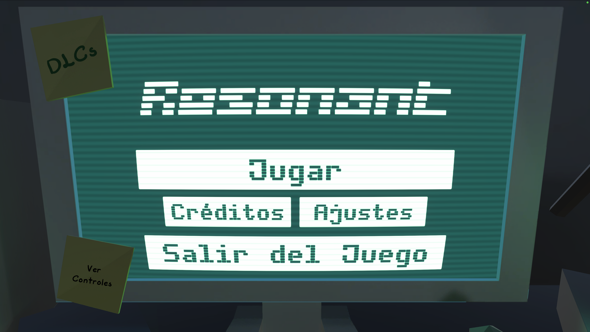

# **RESONANT**

v2.0.0

# Índice

## Historial de Versiones

## Introducción

### Descripción breve del concepto

### Descripción breve de la historia y personajes

### Propósito, público objetivo y plataformas

## Estudio y Equipo de Desarrolladores

### Herramientas de Desarrollo

## Monetización

### Pilares del Equipo en la Monetización

### Tipo de modelo de monetización

## Mecánicas de Juego y Elementos de Juego

### Descripción detallada del concepto de juego

#### Niveles con los que contará el juego

### Descripción detallada de las mecánicas de juego

#### Control de Unidades y Gameplay principal

##### Diagrama flujo de juego

##### Diagrama flujo de fase de combate

#### Descripción de las Estadísticas de las Unidades

#### Tipos de Unidades y sus Características

#### Habilidades de las Unidades

#### Costes de las Unidades

### Modos de Juego y Controles

#### Controles en UI

#### Controles en Modo Mapa del Mundo

#### Controles en Modo Editor de Batalla

#### Controles en Modo Batalla

### Niveles y Misiones

## Narrativa y guión

## Arte

# 

# Historial de Versiones

<table>
  <tr>
   <td><strong>Versión</strong>
   </td>
   <td><strong>Fecha</strong>
   </td>
   <td><strong>Autor</strong>
   </td>
   <td><strong>Descripción</strong>
   </td>
  </tr>
  <tr>
   <td>v0.1.0
   </td>
   <td>04/10/2025
   </td>
   <td>Alberto
   </td>
   <td>Añadida la Estructura General del GDD
   </td>
  </tr>
  <tr>
   <td>v0.1.1
   </td>
   <td>05/10/2025
   </td>
   <td>Raúl
   </td>
   <td>Se añadió una sección para el Historial de Versiones
   </td>
  </tr>
  <tr>
   <td>v0.1.2
   </td>
   <td>08/10/2025
   </td>
   <td>Alberto
   </td>
   <td>Se completó la parte de Gameplay y flujo de juego
   </td>
  </tr>
  <tr>
   <td>v0.1.3
   </td>
   <td>13/10/2025
   </td>
   <td>Raúl
   </td>
   <td>Se desarrolló la zona de Controles y Jugabilidad
   </td>
  </tr>
  <tr>
   <td>v0.1.4
   </td>
   <td>15/10/2025
   </td>
   <td>Guillermo
   </td>
   <td>Se desarrolló la zona de Arte 2D
   </td>
  </tr>
  <tr>
   <td>v0.1.5
   </td>
   <td>17/10/2025
   </td>
   <td>Raúl
   </td>
   <td>Se completó la sección de Monetización
   </td>
  </tr>
  <tr>
   <td>v0.1.6
   </td>
   <td>18/10/2025
   </td>
   <td>Andrés
   </td>
   <td>Se completó la sección de Música, Sonido y Mecánicas de Juego
   </td>
  </tr>
  <tr>
   <td>v0.1.7
   </td>
   <td>19/10/2025
   </td>
   <td>Guillermo
   </td>
   <td>Se completó la sección de Interfaz y se aclaró el uso de UVs en el apartado Arte.
   </td>
  </tr>
  <tr>
   <td>v0.1.8
   </td>
   <td>19/10/2025
   </td>
   <td>Estanis
   </td>
   <td>Se completó la sección de Arte 3D y Narrativa, antes presente en otros documentos paralelos.
   </td>
  </tr>
  <tr>
   <td>v1.0.0
   </td>
   <td>16/11/2025
   </td>
   <td>Todo el equipo
   </td>
   <td>Actualización del GDD para entrega de la fase Beta
   </td>
  </tr>
  <tr>
   <td>v2.0.0
   </td>
   <td>9/12/2025
   </td>
   <td>Todo el equipo
   </td>
   <td>Actualización del GDD para entrega de la fase Gold
   </td>
  </tr>
</table>

# Introducción

## Descripción breve del concepto

Resonant es un videojuego de táctica por turnos centrado en la estrategia. En él tomarás el papel de un “resonante”, una persona con la capacidad de “viajar” en el tiempo que deberá viajar a diferentes épocas históricas para mantener la estabilidad de la línea temporal. Para ello deberá usar tropas y unidades de ese momento histórico.

**Inspiraciones: **El proyecto toma como inspiración jugable a otros juegos de estrategia como pueden ser Fire Emblem o Final Fantasy Tactics. En cuanto a arte el juego es influenciado por títulos como Octopath Traveler o Triangle Strategy. Y en lo que se refiere a narrativa está influenciado por series como el Ministerio del tiempo o películas como Las aventuras de Peabody y Sherman.

## Descripción breve de la historia y personajes

Resonant nos sumerge en un futuro cercano donde los viajes en el tiempo, controlados por la IA CRONOS, han provocado desapariciones misteriosas. El jugador controla a Richard, un resonante capaz de interactuar con figuras históricas y liderar tropas para restaurar la línea temporal. En su camino enfrentará a Los Alteradores, antiguos sujetos de prueba manipulados por la IA maligna CRONOS-ALPHA, y a antagonistas como Salvatore, Robespierre y Jeanne, cada uno con objetivos propios. Desde Grecia y Egipto hasta Japón Sengoku, Richard deberá tomar decisiones estratégicas y éticas que definirán el destino de la historia. El juego combina acción táctica, estrategia y narrativa histórica en una experiencia épica donde cada elección cuenta.

## Propósito, público objetivo y plataformas

El juego está dirigido principalmente a jugadores familiarizados con el género, pero mantiene un enfoque family friendly, lo que permite que también pueda ser disfrutado por audiencias más jóvenes sin perder su esencia estratégica. Además, está pensado para atraer a quienes sienten curiosidad por la historia universal, ya que incorpora elementos históricos de forma accesible y educativa.

Las principales plataformas en las que se jugará el juego serán PC y móvil con soporte en Web. La principal motivación del jugador será seguir una historia divertida a la par que interesante en la que el jugador emplee elementos estratégicos para conseguir la mayor puntuación en cada nivel.

# Estudio y Equipo de Desarrolladores

En The Cursed Onion, somos un equipo pequeño y versátil. Donde cada miembro asume múltiples roles y se autogestiona para impulsar nuestro proyecto con agilidad y eficiencia. Nuestro equipo:

* Raúl: Programador y Desarrollador de Shaders / VFX.
* Guillermo: Diseñador de SFX y Personajes, y Artista 2D.
* Alberto: Programador y Level Designer.
* Andrés: Gameplay Designer, Level Designer y Compositor Principal.
* Estanis: Artista Gráfico y 3D,  Storywriter y Community Manager.

## Herramientas de Desarrollo

El desarrollo del videojuego se realiza con el motor Unity, actualmente en la versión 6000.0.58f1. Debido a problemas de seguridad detectados en esta versión, se tiene previsto migrar a la versión 6000.0.58f2 de cara al lanzamiento. 

El código fuente se ha escrito principalmente en C#, usando tanto Visual Studio como Visual Studio Code como entornos de desarrollo. Para funcionalidades web específicas, se ha incorporado código en JavaScript.

En cuanto a la parte artística se ha empleado diferentes herramientas atendiendo a las necesidades específicas de cada campo:

* La producción musical y los efectos de sonido (SFX) se llevan a cabo con FL Studio.
* En cuanto a Assets 2D se emplean tanto Aseprite como Krita para la elaboración de sprites, ilustraciones, texturas y otros elementos gráficos.
* En lo que respecta al apartado de modelado 3D se utiliza Blender.

# **Monetización**

Para escoger el modelo de monetización a implementar en nuestro videojuego, se han establecido 2 pilares:

## Pilares del Equipo en la Monetización

1. NO ABUSAR DEL CONTENIDO DE PAGO
2. MANTENER CONFIANZA CON NUESTROS JUGADORES

## Tipo de modelo de monetización

El tipo de monetización planeado para “Cronos” es el modelo Buy2Play junto con una serie de expansiones a modo de DLCs que los jugadores podrán optar por comprar.

Cada una de estas expansiones añadirá nuevo contenido como mapas, unidades nuevas o misiones exclusivas.

A su vez, tras el lanzamiento del juego, se proporcionarán actualizaciones gratuitas para realizar ajustes y balanceos o similar a los DLCs añadiendo nuevo contenido sin tener que estar bloqueado bajo.

Con este modelo mixto, se planea:

* Generar más ingresos recurrentes.
* Mantener el interés de toda la comunidad mediante las actualizaciones gratuitas.
* Evitar el uso de formas de pago agresivas para sostener el desarrollo y vida del juego.
* Es flexible en cuanto a la monetización, pues si hay mucha demanda, los DLCs son muy rentables; y si se necesita fidelizar con el público, proporcionar actualizaciones gratis es la mejor estrategia para que vean que estamos dispuestos a atenderles como empresa.

Para la correcta realización y aplicación de este modelo se han tenido en cuenta posibles riesgos y definido reglas para evitarlos:

<table>
  <tr>
   <td><strong>Riesgo</strong>
   </td>
   <td><strong>Solución</strong>
   </td>
  </tr>
  <tr>
   <td><strong>Percepción Negativa de los DLCs: </strong>Pueden llegar a parecer contenido recortado del juego base.
   </td>
   <td>Asegurarse de que el juego base contenga una buena variedad de contenido y que además se vea también expandido mediante las Actualizaciones gratuitas.
   </td>
  </tr>
  <tr>
   <td><strong>Carga de Desarrollo:</strong> Trabajar tanto para DLCs como en Actualizaciones gratuitas puede sobrecargar nuestro equipo de desarrollo.
   </td>
   <td>Realizar planificaciones para determinar el orden y la prioridad en qué se debe trabajar atendiendo a la comunidad y sus necesidades.
   </td>
  </tr>
  <tr>
   <td><strong>Desbalance entre DLCs y Actualizaciones Gratuitas.</strong>
   </td>
   <td>Enfocarse más en el desarrollo de actualizaciones gratuitas para ganar el apoyo del público, lo que conlleva una percepción positiva de nosotros y animará a los jugadores a comprar algún DLC pues tendrán mayor confianza de su calidad.
   </td>
  </tr>
</table>

A continuación se muestra nuestra el contenido que puede incluirse en Actualizaciones Gratuitas o en DLCs

<table>
  <tr>
   <td><strong>Tipo de Contenido</strong>
   </td>
   <td><strong>Gratuito</strong>
   </td>
   <td><strong>DLC</strong>
   </td>
  </tr>
  <tr>
   <td>Corrección de Bugs
   </td>
   <td>Sí
   </td>
   <td>No
   </td>
  </tr>
  <tr>
   <td>Balance de Gameplay
   </td>
   <td>Sí
   </td>
   <td>No
   </td>
  </tr>
  <tr>
   <td>Niveles y Zonas nuevos
   </td>
   <td>No
   </td>
   <td>Sí
   </td>
  </tr>
  <tr>
   <td>Unidades nuevas
   </td>
   <td>Puede que en algunas actualizaciones
   </td>
   <td>Sí
   </td>
  </tr>
  <tr>
   <td>Eventos temporales
   </td>
   <td>Sí
   </td>
   <td>No
   </td>
  </tr>
  <tr>
   <td>Nuevas mecánicas
   </td>
   <td>Puede que en algunas actualizaciones
   </td>
   <td>Sí
   </td>
  </tr>
</table>

# **Mecánicas de Juego y Elementos de Juego**

## Descripción detallada del concepto de juego

Se plantean múltiples niveles en los que el jugador consta de un presupuesto para colocar unidades aliadas en zonas determinadas del mapa . Estas unidades serán utilizadas en un tablero donde primará la estrategia por turnos. Donde el jugador podrá combatir y cumplir diferentes objetivos como derrotar a todos los enemigos o resistir a los ataques de las unidades enemigas un cierto tiempo.

Además tras completar el nivel se le ofrecerá al jugador una puntuación en función de cómo de eficiente haya sido su gestión durante la partida. El objetivo principal es completar todos los niveles para progresar y desentrañar la historia del juego.

### Niveles con los que contará el juego:

* Primer Mundo: Grecia (Guerra Médica): Siglo 5 AC
    * Tutorial inicial (mapa sin alturas): Solo el soldado básico disponible, te enseña que puedes colocar unidades en el mapa usando tu budget frente a un costo y luego a moverlas para enfrentarlas y derrotar a otras unidades (presupuesto para 3 del jugador contra 2 enemigas)
    * Tutorial tipos de unidades (mapa con 2 pisos): Soldado y Arquero, te enseña que cada unidad tiene diferentes estadísticas y cualidades, como rangos diferente de ataque.
    * Tutorial habilidades: Soldados, Arqueros, Curanderos y Tanques. Te enseña que las unidades tienen habilidades, cómo usarlas y que cada tipo de unidad tiene una diferente (poner un cuello de botella que defienda un tanque con curas del curandero durante cierta cantidad de turnos).
    * Nivel de Boss (motiva a sus aliados y les sube el ataque un turno): Soldados, Arqueros, Curanderos, Tanques y Exploradores (Hace de tutorial a enemigos boss con gimmicks que usan habilidades)

* Segundo Mundo: Antiguo Egipto (Invasión Romanos): 30 AC
    * Nivel 1: Tutorial Bárbaro (nivel requiere romper cosas) .
    * Nivel 2: Introducción al Ladrón (que te permite dejar aturdidas a unidades enemigas).
    * Nivel 3: Nivel previo al boss del mapa.
    * Nivel de Boss: Zonas que se avisa que el boss hará daño el siguiente turno y hacen mucho daño (alrededor de 10) (cañones).
* Mundo Final: Japón Feudal : 1300-1700
    * Boss Final.

## Descripción detallada de las mecánicas de juego

### Control de Unidades y Gameplay principal

Al iniciar un nivel se mostrará el mapa en su totalidad además de una zona resaltada dónde las unidades aliadas pueden ser desplegadas. Una vez desplegadas todas las unidades, el jugador presionará el botón de “Empezar” y comenzará el turno del primer personaje según las velocidades de cada uno. 

Cada unidad puede realizar una acción de cada en su turno, una de ataque, otra de movimiento y una habilidad (si esa unidad tiene habilidad disponible). Durante el turno de una unidad enemiga, la cámara se centrará en ésta hasta que termine su turno. 

Durante el turno de una unidad aliada, el jugador podrá seleccionar las diferentes unidades del mapa para visualizar sus estadísticas y tomar las decisiones pertinentes. Si selecciona a la unidad que está realizando el turno, aparecerá una interfaz que mostrará las diferentes acciones que puede realizar. 

#### 

#### Diagrama flujo de juego

#### 

#### Diagrama flujo de fase de combate

Para la gestión de los comandos de las unidades se implementó el patrón de diseño Command.

### 

### Descripción de las Estadísticas de las Unidades

* **HP:** Puntos de Vida de la unidad, si estos llegan a cero, la unidad es derrotada.
* **Ataque:** Daño base que puede producir la unidad.
* **Defensa:** Resistencia a los ataques enemigos.
* **Iniciativa:** Determina el orden en el que se mueve la unidad en la iniciativa de turnos. Con este sistema, se rompen aspectos tradicionales de las batallas estratégicas por turnos en donde primero actúa un bando y luego otro; ahora, el jugador deberá pensar acerca del posible orden de actuación de sus unidades. En caso de tener unidades con la misma iniciativa, el jugador podrá decidir con más detalle el orden con el que quiera mover a sus tropas cuando llegue su turno. Cuando dos unidades se enfrentan el primero en atacar será el que mayor velocidad tenga.
* **Movimiento/Velocidad:** La cantidad de casillas que se puede mover la unidad en un turno.
* **Habilidades/Modificadores:** Pueden afectar alguna de las estadísticas base de la unidad.
* El daño aplicado a una unidad se calcula mediante la siguiente fórmula: Puntos de Ataque + (Modificador o Habilidad) - Puntos de Defensa = Daño Resultante. En caso de que el resultado de esta fórmula sea cero o negativo, el ataque realizará un solo punto de daño.

### Tipos de Unidades y sus Características:

Cada unidad contará con un valor mínimo y uno máximo en cada estadística, de esta forma cada unidad que se genere en el campo de batalla tendrá un valor estadístico diferente que les hará destacar. El valor será uno aleatorio entre los valores mínimos y máximos elegido con igual probabilidad.

A continuación se tiene un ejemplo de cómo se reparten los valores estadísticos de cada clase:

* **Soldado:** **Unidad** básica genérica, algo mediocre pero coste más bajo:

<table>
  <tr>
   <td colspan="3" >
Soldado
   </td>
  </tr>
  <tr>
   <td>
   </td>
   <td>min
   </td>
   <td>max
   </td>
  </tr>
  <tr>
   <td>HP
   </td>
   <td>18
   </td>
   <td>20
   </td>
  </tr>
  <tr>
   <td>Atq
   </td>
   <td>12
   </td>
   <td>14
   </td>
  </tr>
  <tr>
   <td>Df
   </td>
   <td>6
   </td>
   <td>7
   </td>
  </tr>
  <tr>
   <td>Vel
   </td>
   <td>9
   </td>
   <td>13
   </td>
  </tr>
  <tr>
   <td>Mv
   </td>
   <td>5
   </td>
   <td>
   </td>
  </tr>
  <tr>
   <td>Coste
   </td>
   <td>500
   </td>
   <td>
   </td>
  </tr>
  <tr>
   <td>Total
   </td>
   <td>46
   </td>
   <td>54
   </td>
  </tr>
</table>

Estos datos están dispuestos a cambios pues se balancearán mediante simulaciones de combate. Las estadísticas de las siguientes unidades se han pensado con las descripciones siguientes en mente:

* **Tanque**: Lento pero muy defensivo: pensado para defender puntos de embudo resistiendo muchos golpes.

<table>
  <tr>
   <td colspan="3" >
Tanque
   </td>
  </tr>
  <tr>
   <td>
   </td>
   <td>min
   </td>
   <td>max
   </td>
  </tr>
  <tr>
   <td>HP
   </td>
   <td>16
   </td>
   <td>19
   </td>
  </tr>
  <tr>
   <td>Atq
   </td>
   <td>11
   </td>
   <td>12
   </td>
  </tr>
  <tr>
   <td>Df
   </td>
   <td>8
   </td>
   <td>9
   </td>
  </tr>
  <tr>
   <td>Vel
   </td>
   <td>3
   </td>
   <td>5
   </td>
  </tr>
  <tr>
   <td>Mv
   </td>
   <td>4
   </td>
   <td>
   </td>
  </tr>
  <tr>
   <td>Coste
   </td>
   <td>600
   </td>
   <td>
   </td>
  </tr>
  <tr>
   <td>Total
   </td>
   <td>44
   </td>
   <td>52
   </td>
  </tr>
</table>

* **Ladrón:** Unidad rápida capaz de aturdir enemigos mediante su habilidad para que no puedan contraatacar.

<table>
  <tr>
   <td colspan="3" >
Ladrón
   </td>
  </tr>
  <tr>
   <td>
   </td>
   <td>min
   </td>
   <td>max
   </td>
  </tr>
  <tr>
   <td>HP
   </td>
   <td>15
   </td>
   <td>18
   </td>
  </tr>
  <tr>
   <td>Atq
   </td>
   <td>14
   </td>
   <td>15
   </td>
  </tr>
  <tr>
   <td>Df
   </td>
   <td>4
   </td>
   <td>5
   </td>
  </tr>
  <tr>
   <td>Vel
   </td>
   <td>15
   </td>
   <td>19
   </td>
  </tr>
  <tr>
   <td>Mv
   </td>
   <td>5
   </td>
   <td>
   </td>
  </tr>
  <tr>
   <td>Coste
   </td>
   <td>550
   </td>
   <td>
   </td>
  </tr>
  <tr>
   <td>Total
   </td>
   <td>48
   </td>
   <td>57
   </td>
  </tr>
</table>

* **Bárbaro**: Mucho daño y mucha vida pero poca defensa y velocidad, puede romper estructuras como paredes agrietadas…

<table>
  <tr>
   <td colspan="3" >
Bárbaro
   </td>
  </tr>
  <tr>
   <td>
   </td>
   <td>min
   </td>
   <td>max
   </td>
  </tr>
  <tr>
   <td>HP
   </td>
   <td>19
   </td>
   <td>22
   </td>
  </tr>
  <tr>
   <td>Atq
   </td>
   <td>15
   </td>
   <td>16
   </td>
  </tr>
  <tr>
   <td>Df
   </td>
   <td>3
   </td>
   <td>4
   </td>
  </tr>
  <tr>
   <td>Vel
   </td>
   <td>4
   </td>
   <td>7
   </td>
  </tr>
  <tr>
   <td>Mv
   </td>
   <td>5
   </td>
   <td>
   </td>
  </tr>
  <tr>
   <td>Coste
   </td>
   <td>600
   </td>
   <td>
   </td>
  </tr>
  <tr>
   <td>Total
   </td>
   <td>45
   </td>
   <td>53
   </td>
  </tr>
</table>

* **Explorador:** Movimiento alto pero estadísticas genéricas.

<table>
  <tr>
   <td colspan="3" >
Explorador
   </td>
  </tr>
  <tr>
   <td>
   </td>
   <td>min
   </td>
   <td>max
   </td>
  </tr>
  <tr>
   <td>HP
   </td>
   <td>15
   </td>
   <td>17
   </td>
  </tr>
  <tr>
   <td>Atq
   </td>
   <td>12
   </td>
   <td>14
   </td>
  </tr>
  <tr>
   <td>Df
   </td>
   <td>8
   </td>
   <td>9
   </td>
  </tr>
  <tr>
   <td>Vel
   </td>
   <td>8
   </td>
   <td>10
   </td>
  </tr>
  <tr>
   <td>Mv
   </td>
   <td>6
   </td>
   <td>
   </td>
  </tr>
  <tr>
   <td>Coste
   </td>
   <td>600
   </td>
   <td>
   </td>
  </tr>
  <tr>
   <td>Total
   </td>
   <td>43
   </td>
   <td>50
   </td>
  </tr>
</table>

* **Arquero:** Coste bajo, tiene unas estadísticas mediocres pero es capaz de atacar desde una casilla de distancia y, a menos de que el enemigo sea otro arquero, no será contraatacado. Aunque si alguien que no es arquero ataca a un arquero este no podrá defenderse.

<table>
  <tr>
   <td colspan="3" >
Arquero
   </td>
  </tr>
  <tr>
   <td>
   </td>
   <td>min
   </td>
   <td>max
   </td>
  </tr>
  <tr>
   <td>HP
   </td>
   <td>16
   </td>
   <td>18
   </td>
  </tr>
  <tr>
   <td>Atq
   </td>
   <td>13
   </td>
   <td>15
   </td>
  </tr>
  <tr>
   <td>Df
   </td>
   <td>5
   </td>
   <td>7
   </td>
  </tr>
  <tr>
   <td>Vel
   </td>
   <td>12
   </td>
   <td>16
   </td>
  </tr>
  <tr>
   <td>Mv
   </td>
   <td>5
   </td>
   <td>
   </td>
  </tr>
  <tr>
   <td>Coste
   </td>
   <td>500
   </td>
   <td>
   </td>
  </tr>
  <tr>
   <td>Total
   </td>
   <td>46
   </td>
   <td>56
   </td>
  </tr>
</table>

* **Curandero:** Muy malas estadísticas y coste bajo pero puede curar a unidades aliadas y debe ser protegido si se quiere aprovechar, ya que su defensa y vida es baja. La cantidad de vida que es capaz de curar es la mitad de su vida redondeada hacia arriba.

<table>
  <tr>
   <td colspan="3" >
Curandero/médico
   </td>
  </tr>
  <tr>
   <td>
   </td>
   <td>min
   </td>
   <td>max
   </td>
  </tr>
  <tr>
   <td>HP
   </td>
   <td>13
   </td>
   <td>15
   </td>
  </tr>
  <tr>
   <td>Atq
   </td>
   <td>8
   </td>
   <td>10
   </td>
  </tr>
  <tr>
   <td>Df
   </td>
   <td>3
   </td>
   <td>5
   </td>
  </tr>
  <tr>
   <td>Vel
   </td>
   <td>2
   </td>
   <td>8
   </td>
  </tr>
  <tr>
   <td>Mv
   </td>
   <td>5
   </td>
   <td>
   </td>
  </tr>
  <tr>
   <td>450
   </td>
   <td>10
   </td>
   <td>
   </td>
  </tr>
  <tr>
   <td>Total
   </td>
   <td>32
   </td>
   <td>41
   </td>
  </tr>
</table>

Esto nos permite ver que dentro de la variabilidad que se crea al randomizar el orden de turnos sigue habiendo una lógica de unidades más a menos veloces. De esta forma un arquero podría ser más rápido que un ladrón pero un tanque nunca podría ser más rápido que ninguno de los dos.

### 

### Habilidades de las Unidades:

* **Soldado:**
    * “Enfado”: Si gasta su turno con su habilidad, el siguiente hace daño extra (la estadística de ataque del soldado se multiplica por 1.3)
* **Tanque:**
    * “Firmeza”:Obtener ps temporal (solo lo puede usar si no se ha movido todavía, pierde el turno (no ataca), su siguiente turno pierde esa vida extra). La vida que gana es equivalente al 20% de su vida.
* **Ladrón:**
    * “Aturdir”: Impedir que alguna unidad ataque y/o se pueda mover aturdiendo o inmovilizando.
* **Bárbaro:**
    * “Destruir”: Romper estructuras que están medio rotas
* **Explorador:**
    * “Sprint”: Usando esta habilidad se puede mover 2 casillas más, pero ya no puede atacar (ya no podría moverse tampoco)
* **Arquero:**
    * “Disperso”: Ataca a 3 casillas en fila haciendo en las 3 un daño fijo (equivalente 40% de la estadística de ataque) (solo se puede usar en las cuatro direcciones cardinales)
* **Curandero/Médico: **
    * “Curar”: Curar lo equivalente a la mitad de la vida del curandero

## 

### Costes de las Unidades:

Se calcula el valor mediante los resultados estadísticos de 640.000 simulaciones de combate realizadas para obtener un ratio de victorias por clase al enfrentarse a cada otro tipo de clase en un combate 1vs1 y con una estimación de cómo de útil es la habilidad de cada personaje. La suma de ambas es usada como un precio base representativo de la clase.

* **Soldado:**			Winrate: 58,8% -	Utility: 40% = 98,8	→ 100
* **Tanque:**			Winrate: 75,3% -	Utility: 40% = 115,3	→ 120
* **Ladrón:**			Winrate: 42,2% -	Utility: 70% = 112,2	→ 110
* **Bárbaro:**			Winrate: 80,5% -	Utility: 40% = 120	→ 120
* **Explorador:**			Winrate: 61,7% -	Utility: 60% = 120	→ 120
* **Arquero:**			Winrate: 51,5% -	Utility: 50% = 100	→ 100
* **Curandero/Médico:**		Winrate: 06,2% -	Utility: 80% = 86,2 	→ 90

Usando esto como base se multiplica el resultado por 5 para que la diferencia de coste sea más intuitiva y fácil de ver visualmente y para que todo sea más intuitivo para el jugador:

* **Soldado:**			500
* **Tanque:**			600
* **Ladrón:**			550
* **Bárbaro:**			600
* **Explorador:**			600
* **Arquero:**			500
* **Curandero/Médico:**		450

## 

## Modos de Juego y Controles

En función de eventos y zonas de juego en donde se encuentre el jugador, se utilizarán esquemas de controles distintos. Además, se podrá detectar si el juego está siendo usado en PC o en un dispositivo móvil o tablet mediante Application.platform o bien usando plugins en javascript (en caso de estar jugándose en WebGL)

### Controles en UI

Se habilitan controles de UI cuando se encuentre algún tipo de interfaz activa.

**En PC:**

Para interactuar con los elementos UI se podrá apuntar con el ratón y clicar en estos elementos; o bien usar WASD para cambiar entre opciones y seleccionar el elemento usando Espacio.

**En Móvil:**

Es similar a usar el ratón en PC, con tocar de forma táctil el botón u otro elemento de la interfaz deseado es suficiente para interactuar con él.

### Controles en Modo Mapa del Mundo

Se tiene una cámara que sigue a un sprite que representa al jugador el cual se desplaza por el mapa para elegir el nivel al que ir.

**En PC:**

El sprite del jugador se mueve sobre raíles mediante las teclas WASD y una vez que se encuentre sobre un nivel, se selecciona usando Espacio o Enter o pulsando un botón de UI que aparece bajo la descripción del nivel.

**En Móvil:**

El sprite del jugador se mueve sobre raíles y el jugador le indica la dirección a la que ir mediante flechas que aparecen alrededor del sprite. \
Una vez que el sprite llegue a estar sobre un nivel, el jugador puede acceder a él pulsando el botón bajo la descripción del nivel.

### 

### Controles en Modo Editor de Batalla

El Modo Editor de Batalla se habilita nada más entrar a un nivel y durante esta fase el jugador podrá elegir qué unidades gastar su dinero y dónde colocarlas.

**En PC:**

La cámara tiene dos modos:

* Movimiento Libre: Se puede desplazar mediante las teclas WASD y rotar hacia la izquierda y derecha 45º usando las teclas Q y E respectivamente

    Si el jugador hace click izquierdo sobre una unidad, podrá ver su interfaz de acciones y estadísticas.

* Movimiento Controlado: La cámara sigue a un selector de unidades, interpolando su posición, y puede ser  rotada mediante las teclas Q y E

    Entonces, con las teclas WASD se podrá desplazar este selector de unidades por el mapa o usando directamente click izquierdo.

    Para seleccionar una unidad y visualizar mediante su interfaz qué acciones puede realizar y sus estadísticas, se deberá usar click derecho o espacio.

Para cambiar el modo de la cámara, el jugador dispondrá de un botón especializado con esta función o pulsando Tabulador.  Para colocar tropas, primero deberá seleccionarlas de las que tenga a su disposición en un menú en el lateral y hacer click donde las quiera colocar.  Para quitarlas si se ha equivocado, basta con seleccionar la herramienta borrador y clicar en las unidades a eliminar. Una vez que considere que todo está preparado, tendrá que pulsar el botón de “Empezar Nivel” o pulsar la tecla enter.

**En Móvil:**
Los modos de la cámara son:

* Movimiento Libre: Se puede desplazar deslizando el dedo por la pantalla y rotar mediante unos botones activos en la UI específicos cuando se detecte que se está jugando en un dispositivo móvil o tablet. Similar a PC, pulsando sobre cualquier unidad, abrirá su interfaz de estadísticas y acciones.
* Movimiento Controlado: La cámara sigue a un selector de unidades y de forma similar, se podrá rotar usando los botones especiales de rotar la cámara.

    El selector de unidades solo funciona haciendo toques en la pantalla y en caso de tocar sobre una unidad, automáticamente se abre su interfaz.

El jugador seguirá teniendo a su disposición el botón especial de cambiar modo de cámara.  Para colocar tropas, similar a PC, la seleccionará primero del menú lateral y colocarlas pulsando en la posición que desee; y similar para eliminar tropas usando la herramienta borrador.  Una vez que considere que todo está preparado, tendrá que pulsar el botón de “Empezar Nivel”.

### Controles en Modo Batalla

El modo batalla se habilita una vez el jugador haya colocado todas sus tropas tras empezar un nivel y no se encuentre ninguna UI interactiva de unidad habilitada.

Los controles son similares al Modo Editor de Batalla, la única diferencia siendo que ahora al seleccionar una unidad podrás instruirla con comandos a realizar.

## Niveles y Misiones

El juego se encuentra divido en niveles, que a su vez se pueden agrupar en distintas épocas históricas separadas. Estás épocas se componen entonces de unos 4 niveles siendo uno de ellos un enfrentamiento contra un boss. El último mapa tiene solamente un nivel de boss.

A medida que el jugador progrese por el juego, las tropas irán cambiando su apariencia acorde a la época histórica. En los niveles, se dispone de una selección fija de tropas que el jugador puede comprar usando una cantidad de dinero que se le ofrezca para cumplir con el objetivo de ese nivel, que puede ser:

* Derrotar a las tropas enemigas.
* Derrota a un comandante enemigo.
* Sobrevivir una cantidad de turnos defendiendo tus tropas.

Con el diseño de niveles se busca enseñar al jugador las diferentes capacidades/usos de las unidades y sus respectivas habilidades para después ponerlas a prueba en combates que sean entretenidos y sean optimizables para los jugadores que buscan conseguir la mejor puntuación posible. Además los niveles se diseñarán con diferentes niveles de altura y terrenos más difíciles de cruzar, lo que permite que el jugador pueda aprovechar su entorno de forma estratégica y optimizarlo. A continuación se tiene un ejemplo de cómo se diseñarán los niveles:

>>>>>  gd2md-html alert: inline image link here (to images/image2.jpg). Store image on your image server and adjust path/filename/extension if necessary.  (<a href="#">Back to top</a>)(<a href="#gdcalert3">Next alert</a>) >>>>> 

# 

# Narrativa y guión

# 

# **Arte**
